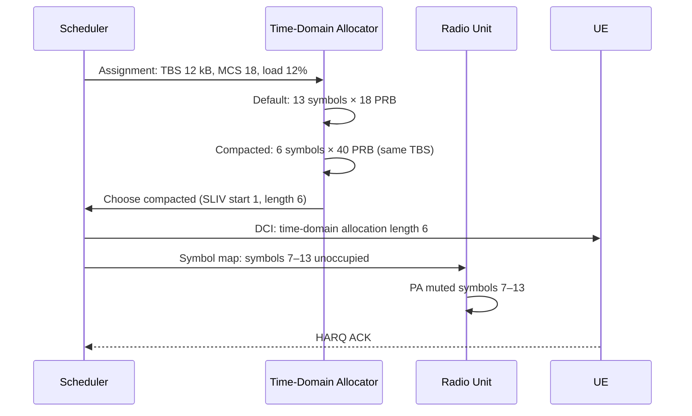

This section describes the operational logic of the Energy-Optimized Symbol Allocation feature. It outlines the decision-making process in the scheduler for symbol compaction and the signaling interaction between the scheduler, radio, and user equipment (UE).

## Operational Mechanism

When the cell load is below the threshold defined by the parameter `compactionLoadThr` (detailed in [Parameters](parameters.md)), the scheduler evaluates candidate downlink assignments to determine if symbol compaction can be applied. For each candidate downlink assignment, the scheduler calculates two potential allocations:

1. **Default Full-Slot Allocation**: The standard time-frequency resource allocation.
2. **Compacted Allocation**: An allocation with the same Transport Block Size (TBS) but configured with the maximum available PRB (Physical Resource Block) width and the shortest Start and Length Indicator Value (SLIV) that can carry the block at the selected Modulation and Coding Scheme (MCS).

### Selection Criteria

The scheduler selects the compacted variant if the following conditions are met:
* The compacted variant fits within the available frequency resources.
* The estimated Signal-to-Interference-plus-Noise Ratio (SINR) supports the wider PRB allocation (wider allocations average over more frequency-selective fading, which is typically a wash).

### Radio and Transmit Execution

Once the compacted allocation is chosen:
* **Symbol Map Forwarding**: The scheduler forwards the per-slot symbol occupation map to the Radio Unit (RU) one slot in advance.
* **PA Muting**: The radio mutes its Power Amplifier (PA) starting from the last occupied symbol until the end of the slot, thereby saving transmit energy.
* **UE Allocation**: The scheduler sends the Downlink Control Information (DCI) to the UE indicating the shortened time-domain allocation (e.g., allocation length).

## Process Flow

The sequence below illustrates the interaction between the scheduler, the internal time-domain allocator, the radio unit, and the UE during an active compacted downlink transmission:

## HARQ and Uplink Handling

* **HARQ Retransmissions**: To maintain soft-combining alignment, HARQ retransmissions reuse the original allocation shape.
* **Uplink**: The uplink is unaffected by this feature. Symbol compaction is strictly a downlink transmit-energy-saving mechanism.

# Cross-References

* [Feature Overview](feature-overview.md) — For a high-level description of the Energy-Optimized Symbol Allocation feature.
* [Parameters](parameters.md) — For information on the configuration parameter `compactionLoadThr`.
* [Network Impact](network-impact.md) — For how this symbol compaction affects performance KPIs.
