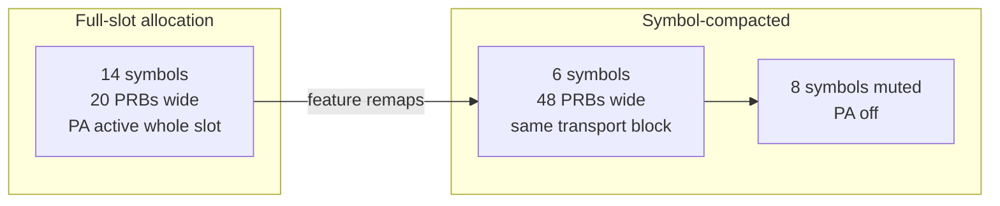

The Energy-Optimized Symbol Allocation feature reduces radio unit energy consumption by compacting downlink transmissions within a slot into the smallest possible number of OFDM symbols. This allows the transmit chain to be muted for the remaining symbols of the slot, operating at a finer granularity than slot-level mechanisms.

## Functional Description

Where slot-level mechanisms (such as Energy-Optimized Slot Allocation) create entirely empty slots, Energy-Optimized Symbol Allocation harvests energy inside slots that must carry data.

The mechanism builds on the NR flexible time-domain resource allocation framework defined in TS 38.214:
* **Time-Domain Allocation Flexibility:** A Physical Downlink Shared Channel (PDSCH) does not need to span all 14 symbols of a slot. Using PDSCH mapping type B and configurable start-and-length indicator values (SLIV), allocations of 2, 4, 7, or other symbol lengths can be made.
* **Default Configuration:** In default configurations, the scheduler uses full-slot (type A, symbols 1–13) allocations to maximize the transport block size (TBS) per Downlink Control Information (DCI) message.
* **Low/Medium Load Remapping:** Under low load conditions, pending data for a slot often fits into a smaller number of symbols (such as 4 or 7) if the frequency allocation is widened. The feature trades frequency for time by allocating more Physical Resource Blocks (PRBs) over fewer symbols while keeping the TBS constant, shortening the overall transmission duration.

### Power Amplifier Muting

The radio mutes the Power Amplifier (PA) for the unused trailing symbols of the slot. This mechanism is referred to as **symbol-level micro sleep** and is executed by NR Micro Sleep Tx. 

Because PA bias consumption is roughly proportional to active transmission time, reducing the average occupied symbols per active slot from 13 down to 6 nearly halves the PA energy consumption in those slots.

### Constraints and Compatibility

* **Reference Signal and Control Constraints:** Physical Downlink Control Channel (PDCCH), Demodulation Reference Signal (DMRS), and Channel State Information Reference Signal (CSI-RS) placement constraints are strictly honored. The compacted PDSCH always includes its front-loaded DMRS, and symbols carrying periodic CSI-RS or Synchronization Signal Blocks (SSB) are excluded from muting.
* **UE Transparency:** The feature is completely transparent to User Equipments (UEs). Time-domain allocation is signaled per assignment in the DCI, ensuring compliance with any 3GPP-compliant UE.
* **Energy Savings:** Typical incremental savings range between 3% and 7% of radio energy on top of slot-level mechanisms. The largest contribution is observed at medium load, where full slot emptying is no longer possible.

# Cross-References

* [Feature Dependencies](feature-depedencies.md) — Prerequisites and system dependencies for this feature.
* [Feature Operation](feature-operation.md) — Detailed operational behavior and scheduling logic.
* [Parameters](parameters.md) — Configuration and tuning parameters for symbol-level optimization.
* [Activation Procedure](activation-procedure.md) — How to enable and commission the feature in the network.
