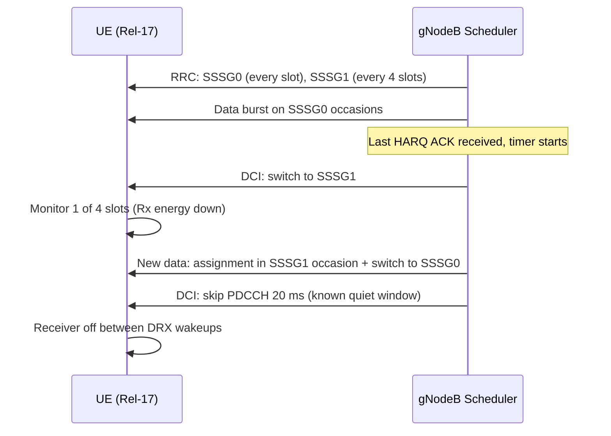

This section describes the detailed operational mechanics of the Flexible PDCCH Monitoring feature. It details how Search Space Set Groups (SSSGs) are dynamically switched and skipped based on UE activity and configured per-5QI policies.

## SSSG Configuration and Switching Mechanics

At RRC connection setup or reconfiguration, capable UEs are configured with two Search Space Set Groups (SSSGs):
*   **SSSG0**: Dense monitoring with cell default periodicity.
*   **SSSG1**: Sparse monitoring, occurring every `sparsePeriod` slots.

The gNodeB scheduler tracks per-UE activity to manage transitions between these groups:
1.  **SSSG0 (Active State)**: While data or HARQ feedback is pending, the UE is kept in SSSG0.
2.  **Transition to SSSG1 (Inactive State)**: When the `sssgSwitchTimer` expires after the last scheduled activity, the gNodeB indicates a switch to SSSG1.
3.  **Transition back to SSSG0**: New data arrival triggers an immediate switch back. To prevent extra round-trip latency, the first scheduling assignment is sent directly within an SSSG1 occasion alongside the group-switch indication.
4.  **PDCCH Skipping**: When the scheduler positively identifies a quiet window (for example, after the final segment of a VoNR talk spurt with silence descriptor pacing, or after an RRC release has been decided but not yet executed), it issues a skip indication covering the specific window duration.

### Sequence Diagram: PDCCH Monitoring Transitions

## Per-5QI Policy Mapping

A per-5QI policy maps each configured service class to one of three monitoring profiles. The overall UE monitoring profile is determined by the strictest profile among the UE's active bearers:

| Monitoring Profile | Description |
| :--- | :--- |
| **FULL** | Never uses sparse monitoring (always kept in SSSG0). |
| **ADAPTIVE** | Timer-based switching between SSSG0 and SSSG1. |
| **AGGRESSIVE** | Supports both timer-based switching and active skipping during known quiet windows. |

# Cross-References

*   [Feature Overview](feature-overview.md)
*   [Parameters](parameters.md) — For configuration details on `sssgSwitchTimer` and `sparsePeriod`.
