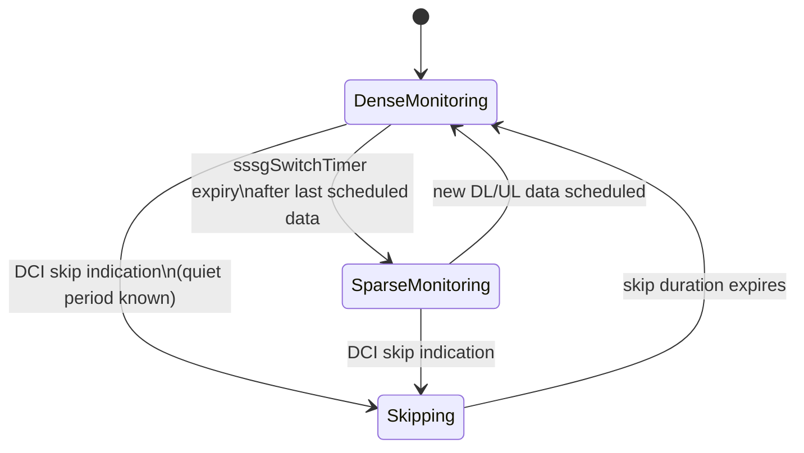

# Feature Overview

Flexible PDCCH Monitoring is a feature designed to reduce User Equipment (UE) energy consumption in connected mode. It adapts how often a UE must monitor the Physical Downlink Control Channel (PDCCH) using the search space set switching and PDCCH skipping mechanisms introduced with the 3GPP Release 16/17 UE power saving framework (TS 38.213, TS 38.331).

PDCCH monitoring is a dominant contributor to smartphone modem energy. Even with no active data transfer, a connected UE outside of Discontinuous Reception (DRX) sleep must wake its receiver every slot (or monitoring occasion) to perform blind decoding of PDCCH candidates. For traffic patterns characterized by long user think times (such as web browsing, messaging, or background synchronization), the majority of these blind decoding attempts do not yield any data.

---

## Core Mechanisms

The feature provides the gNodeB with two primary levers to optimize monitoring behavior:

1. **Search Space Set Group (SSSG) Switching**  
   The UE is configured with two distinct monitoring profiles:
   * **Dense Group**: Used during active data transfer (e.g., monitoring every slot).
   * **Sparse Group**: Used between traffic bursts (e.g., monitoring every 4 or 8 slots).
   
   The gNodeB can switch the UE between these groups either **explicitly** (via a Downlink Control Information (DCI) format 2_0/2_6 indication) or **implicitly** (via a timer that expires after the last scheduled transmission).

2. **PDCCH Skipping**  
   During a known quiet period, the gNodeB can instruct the UE to skip PDCCH monitoring entirely for a configured duration (up to tens of milliseconds) using a single DCI indication. This mechanism provides a faster and lower-overhead alternative to RRC-based Connected Mode DRX (C-DRX) reconfiguration.

---

## State Transition Diagram

The following state diagram illustrates the transitions between dense monitoring, sparse monitoring, and skipping states:

---

## Comparison and Integration with Connected Mode DRX

Flexible PDCCH Monitoring operates at a significantly finer timescale than standard Connected Mode DRX (C-DRX):
* **DRX Cycles**: Typically last tens to hundreds of milliseconds and require high-overhead Radio Resource Control (RRC) reconfiguration to adjust.
* **Flexible PDCCH Monitoring**: Reacts within a few slots using Layer-1 (L1) signaling.

These two frameworks are complementary and compose together: Flexible PDCCH Monitoring saves additional energy inside the active time of the DRX cycle.

### Performance Impact
* **Power Reduction**: UE energy simulations following the 3GPP TR 38.840 methodology, combined with field trials, show an additional **10% to 20% power reduction** in connected mode for bursty traffic on top of an already tuned C-DRX configuration.
* **Scheduling Latency**: The scheduling latency for the first packet following a quiet period is increased by at most the duration of the sparse monitoring period, which is bounded by design to a few milliseconds.

# Cross-References

* [Feature Dependencies](feature-depedencies.md) — Requirements and interactions with other system features.
* [Feature Operation](feature-operation.md) — Detailed operational behavior, state transitions, and signaling.
* [Network Impact](network-impact.md) — Impact on network capacity, performance, and key performance indicators.
* [Parameters](parameters.md) — Configuration parameters controlling SSSG switching and PDCCH skipping.
* [Performance Management](performance-management.md) — Counters and KPIs used to monitor the feature's performance.
* [Activation Procedure](activation-procedure.md) — Steps required to enable the feature in the network.
* [Deactivation Procedure](deactivation-procedure.md) — Steps required to disable the feature in the network.
