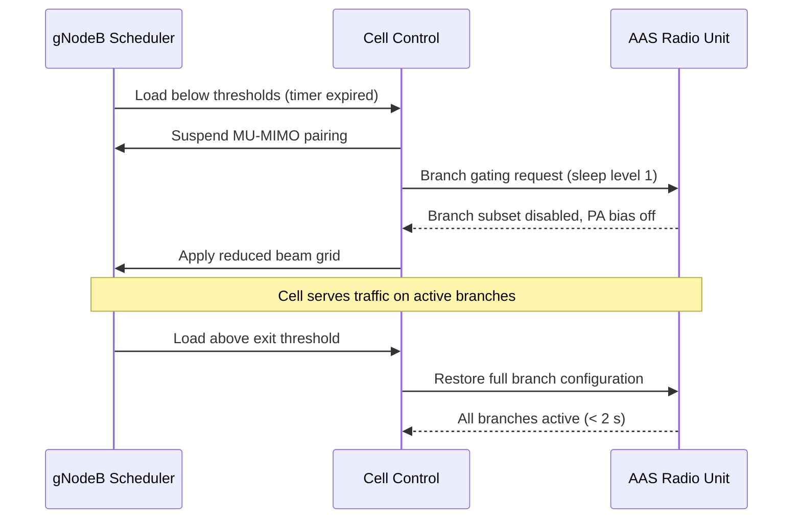

The **NR Massive MIMO Sleep Mode** feature is controlled on a per-NR-cell basis. It uses continuous evaluation of cell load to dynamically transition the AAS Radio Unit (RU) into a power-saving state (sleep level 1) while preserving basic coverage.

## Dynamic Load Evaluation and Sleep Entry

The gNodeB scheduler continuously evaluates two load measures over a sliding window:
*   **Average downlink PRB utilization**
*   **Number of RRC-connected UEs**

When both measures fall below their respective entry thresholds (`prbLoadEnterThr` and `connUsersEnterThr`) and remain below them for the duration of the entry timer (`sleepEnterTimer` seconds), the cell initiates the sleep entry process. 

Upon entering sleep mode, the cell:
1.  Suspends MU-MIMO pairing.
2.  Requests the AAS Radio Unit to gate the configured branch subset (disabling the branches and turning off Power Amplifier (PA) bias).
3.  Switches the SSB beam configuration to a pre-computed reduced-branch grid to ensure coverage of the broadcast channels is preserved.

Once active in sleep mode, the cell continues to serve traffic on the remaining active branches.

## Sleep Exit

When the load exceeds the exit threshold, the gNodeB scheduler triggers the exit process:
1.  The cell control requests the AAS Radio Unit to restore the full branch configuration.
2.  The AAS Radio Unit activates all branches. This restoration takes less than 2 seconds (`< 2 s`).

## Time-of-Day Restriction

An optional time-of-day window can be configured via parameters `sleepAllowedStart` and `sleepAllowedStop`. This window restricts when the cell is allowed to enter sleep mode. This configuration is recommended for cells with highly volatile night-time load, such as event venues, to prevent unnecessary sleep transitions.

## Sequence of Operations

The sequence of interactions between the gNodeB Scheduler (SCH), Cell Control (CC), and AAS Radio Unit (RU) during sleep entry and exit is illustrated below:

# Cross-References

*   [Feature Overview](feature-overview.md) — For a high-level description of the NR Massive MIMO Sleep Mode feature.
*   [Parameters](parameters.md) — For descriptions of thresholds and timers such as `prbLoadEnterThr`, `connUsersEnterThr`, and `sleepEnterTimer`.
*   [Performance Management](performance-management.md) — For monitoring the impact of sleep mode operations.
*   [Activation Procedure](activation-procedure.md) — For instructions on enabling this feature.
