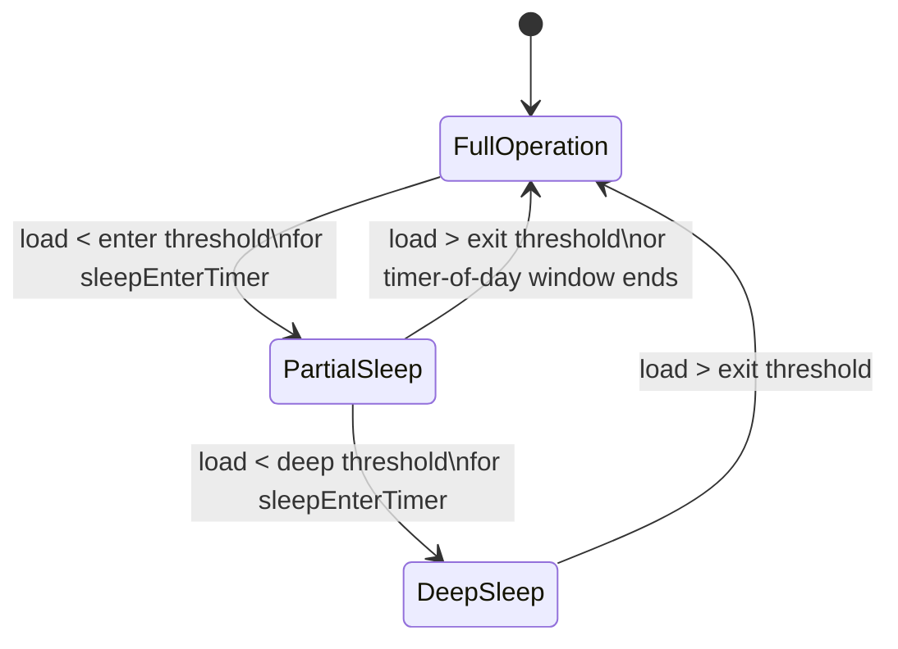

NR Massive MIMO Sleep Mode reduces the energy consumption of Advanced Antenna System (AAS) radios by switching off a configurable subset of transmit and receive branches—along with their associated power amplifiers and transceiver chains—during periods of low traffic load in the cell.

## Functional Overview

A Massive MIMO radio operating a mid-band TDD carrier typically runs 32 or 64 transceiver branches. The energy consumed by the power amplifiers is largely independent of the amount of user data carried: at 3 a.m., with a handful of connected UEs, the radio draws close to the same power as at the busy hour. 

This feature exploits that gap. When downlink Physical Resource Block (PRB) utilization and the number of connected users fall below configured thresholds for a sustained period, the cell autonomously transitions into a sleep level where, for example, only 16 of 64 branches remain active. Common channels (SSB, SIB, PRACH reception) continue to be served by the remaining active branches with an adapted beamforming configuration, so the cell stays fully available for access, paging, and mobility. When load rises above the exit threshold, the cell restores the full branch configuration within seconds.

### State Transitions

The state diagram below illustrates the transitions between Full Operation, Partial Sleep, and Deep Sleep based on traffic load and configured thresholds.

## Sleep Depths

Two sleep depths are supported by the feature:

*   **Partial Sleep**: Half of the transceiver branches are disabled. Peak MU-MIMO capacity is reduced, but SU-MIMO up to 4 layers and full beam sweeping remain available.
*   **Deep Sleep**: Only a quarter of the branches remain active. The cell operates with wide static beams comparable to a conventional 4T4R sector.

## Measured Energy Savings

Typical measured savings are **20–35%** of radio unit energy consumption during low-traffic hours, depending on the radio model and traffic profile.

# Cross-References

*   [Feature Operation](feature-operation.md) — For details on state entry and exit thresholds, load metrics, and timer configurations.
*   [Parameters](parameters.md) — For configuration parameters related to enter/exit thresholds and timers.
*   [Network Impact](network-impact.md) — For coverage and capacity considerations when operating in reduced branch configurations.
