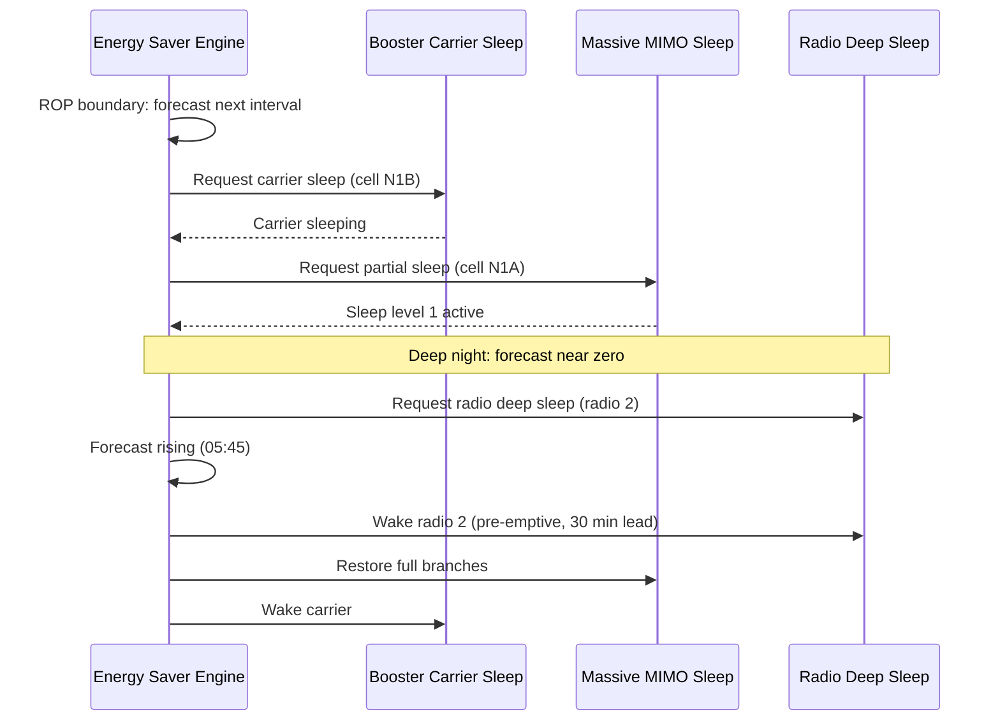

The **Feature Operation** section describes the operational mechanics of the Automated Energy Saver decision engine, including interval load forecasting, policy-based confidence margins, ordered sleep/wake execution sequences, and pre-emptive wake-up timing.

## Decision Engine and Forecasting

The decision engine runs every 15 minutes, synchronized to the Result Output Period (ROP) boundary. For each cell, it generates a load forecast for the upcoming interval, expressed in terms of:

- Expected PRB (Physical Resource Block) utilization
- Expected RRC-connected users

## Policy Margins (`savingsLevel`)

The load forecast is mapped to a target energy state according to the operator's configured `savingsLevel` policy:

- **CONSERVATIVE**: Forecast plus a **3-sigma** margin must stay below the subordinate feature's entry threshold.
- **BALANCED**: Uses a **2-sigma** margin.
- **AGGRESSIVE**: Uses a **1-sigma** margin.

## Sleep and Wake-Up Ordering

State requests are issued to subordinate features in a fixed hierarchical order:

1. **Booster carriers** (first to sleep)
2. **Massive MIMO branch sleep** (second to sleep)
3. **Radio deep sleep** (last to sleep)

During wake-up, the engine processes requests in exact reverse order (radio deep sleep $\rightarrow$ Massive MIMO branch sleep $\rightarrow$ booster carriers) to ensure capacity is restored bottom-up before it is required.

Wake-ups are triggered pre-emptively with a configurable lead time (`wakeupLeadTime`) prior to the forecasted load increase. This removes reactive wake-up latency of subordinate features from user experience during the morning load ramp.

## Sequence Flow

# Cross-References

- [Parameters](parameters.md) — Configurable parameters governing decision engine thresholds and timing (such as `savingsLevel` and `wakeupLeadTime`).
