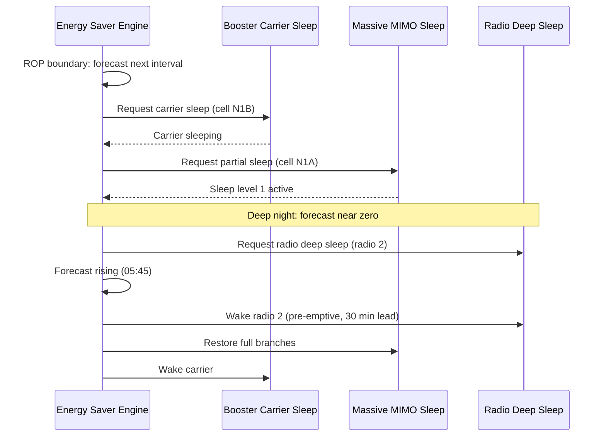

This section describes the operational logic of the Automated Energy Saver feature, including decision engine scheduling, load forecasting, policy-driven threshold mapping, subordinate feature execution sequence, and pre-emptive wake-up handling.

## Decision Engine and Load Forecasting

The decision engine runs every 15 minutes, aligned to the Result Output Period (ROP) boundary. For each cell, the engine produces a load forecast for the next interval, expressed as:

- Expected Physical Resource Block (PRB) utilization
- Expected RRC-connected users

## Savings Level Policy

The load forecast is mapped to a target energy state according to the operator's `savingsLevel` policy:

| Policy Level | Required Margin | Entry Condition |
| :--- | :--- | :--- |
| **CONSERVATIVE** | 3-sigma margin | Forecast plus 3-sigma margin must stay below the subordinate feature's entry threshold. |
| **BALANCED** | 2-sigma margin | Forecast plus 2-sigma margin must stay below the subordinate feature's entry threshold. |
| **AGGRESSIVE** | 1-sigma margin | Forecast plus 1-sigma margin must stay below the subordinate feature's entry threshold. |

## Subordinate Feature Control Sequence

State requests are issued to subordinate features in a fixed order to manage network energy states safely:

1. **Sleep Sequence:**
   1. Booster carriers first
   2. Massive MIMO branch sleep second
   3. Radio deep sleep last

2. **Wake-Up Sequence:**
   - Reversed relative to sleep order (Radio deep sleep restored first, followed by Massive MIMO branches, and booster carriers last).
   - Restores capacity bottom-up before it is needed.

### Pre-Emptive Wake-Up

Wake-ups are issued pre-emptively with a configurable lead time (`wakeupLeadTime`) ahead of the forecasted load rise. This eliminates the reactive wake-up latency of subordinate features from the user experience during morning traffic ramps.

## Sequence Diagram

# Cross-References

- [Feature Overview](feature-overview.md)
- [Parameters](parameters.md)
- [Network Impact](network-impact.md)
