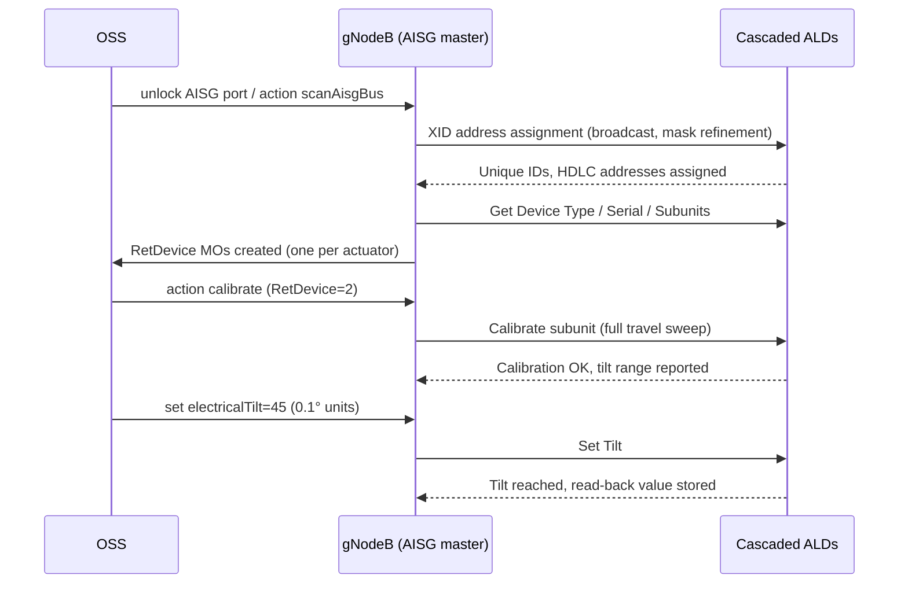

This section details the operational workflow for Cascaded RET Support in the gNodeB, covering AISG bus scanning, device discovery and Managed Object (MO) creation, actuator calibration, electrical tilt adjustment, and continuous supervision.

## AISG Bus Scanning and Device Discovery

Operation begins with bus scanning when a RET-capable port is unlocked. The node runs the AISG device-scan state machine:

1. Broadcasts an XID address-assignment frame.
2. Collects unique-ID responses from all unaddressed devices.
3. Resolves collisions by mask refinement.
4. Assigns each ALD a distinct HDLC address.

For each discovered device, the node reads:
- Device type
- Vendor code
- Serial number
- Number of subunits (multi-RET actuators expose one subunit per drivable array)

Following discovery, the node instantiates or matches a `RetDevice` MO for each actuator.

## Sequence Diagram

## Calibration, Tilt Control, and Supervision

- **Calibration**: After discovery, each actuator must be calibrated once through a full-travel sweep (allowing the actuator to learn its mechanical end stops) before tilt commands are accepted.
- **Tilt Control**: Tilt is set in 0.1-degree units within the device-reported range.
- **Continuous Supervision**: The node continuously supervises each device using a keep-alive poll. If a device stops responding, an ALD supervision alarm is raised that identifies the exact position in the cascade, which materially shortens fault localization on shared-antenna sites.

# Cross-References

- [FEATURE OVERVIEW](feature-overview.md)
- [PARAMETERS](parameters.md)
- [ACTIVATION PROCEDURE](activation-procedure.md)
