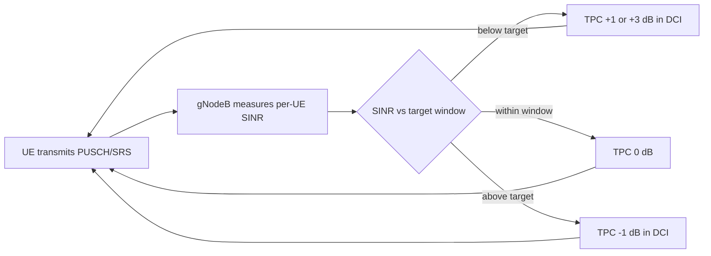

This section provides a feature overview for Closed-Loop Power Control High-Band within NR high-band (FR2, mmWave) deployments.

## Overview

Closed-Loop Power Control High-Band introduces network-controlled, closed-loop adjustment of UE uplink transmit power on NR high-band (FR2, mmWave) carriers operating as PCells or SCells in a carrier aggregation configuration.

### Open-Loop Control Limitations on FR2

Without this feature, high-band uplink power is governed purely by open-loop power control:
- The UE estimates pathloss from SSB or CSI-RS measurements.
- The UE derives its PUSCH, PUCCH, and SRS transmit power from broadcast `p0` and `alpha` values as specified in TS 38.213.

While open-loop control is adequate when pathloss estimates are accurate, on FR2 carriers the estimate is inherently noisy due to:
- Abrupt link gain changes when the UE or gNodeB switches beams.
- Blockage events causing step changes of 15–25 dB.
- UE power-class limitations interacting with beam-specific EIRP limits.

### Closed-Loop Operation and Benefits

With this feature active, closed-loop adjustment operates as follows:
- The gNodeB continuously measures received SINR and per-UE received power on PUSCH and SRS.
- The gNodeB compares measurements against a configurable target.
- The gNodeB issues Transmit Power Control (TPC) commands in DCI formats 0_1/0_2 in accumulated or absolute mode.

This mechanism ensures each UE converges on the minimum transmit power that satisfies the receive target. Operational benefits include:
- Reduced inter-cell and inter-beam interference.
- Improved uplink link adaptation accuracy.
- Extended UE battery life.
- Compounded benefits in carrier aggregation deployments, preventing uncontrolled uplink power on one carrier from raising the noise floor for co-scheduled UEs on adjacent beams.

### Measured Performance Gains

Typical measured gains in loaded FR2 cells include:
- **1.5–3 dB reduction** in average uplink interference-over-thermal (IoT).
- **10–20% improvement** in uplink cell-edge throughput (as cell-edge UEs no longer compete against over-powered cell-center UEs).

### Control Flow

