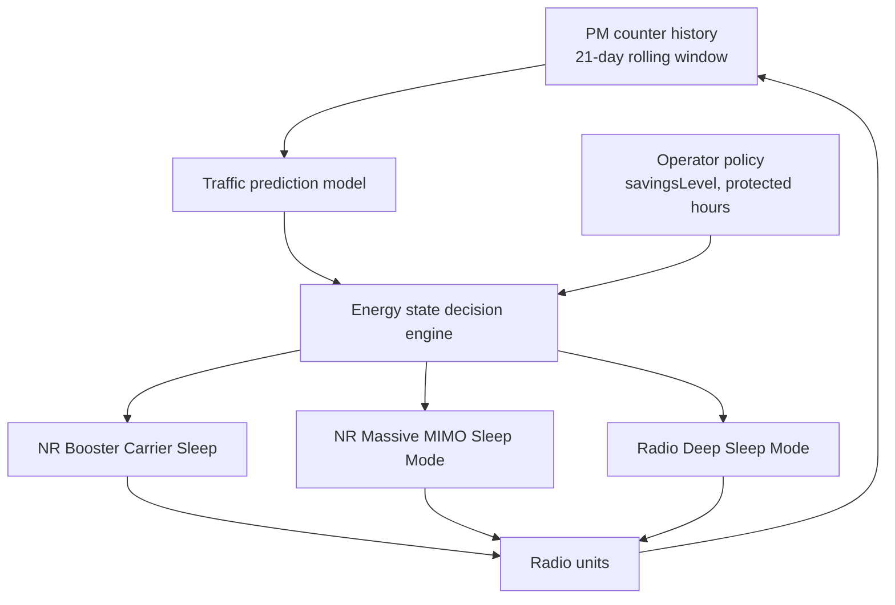

This section provides an overview of the Automated Energy Saver feature, detailing its role as a node-level orchestration layer for gNodeB energy-saving functions.

## Overview and Core Functionality

Automated Energy Saver provides a node-level orchestration layer for individual energy-saving functions available in the gNodeB. Rather than requiring the operator to hand-tune thresholds and time windows for each energy feature on each cell, this feature continuously builds a per-cell traffic prediction model and uses it to arm, tune, and sequence the underlying savers so that the deepest safe saving level is applied at every point of the day without operator intervention.

The underlying energy-saving functions orchestrated by this feature include:
- NR Booster Carrier Sleep
- NR Massive MIMO Sleep Mode
- Radio Deep Sleep Mode
- NR Micro Sleep Tx

## Coordination Problem and Decision Hierarchy

The primary problem addressed by Automated Energy Saver is feature coordination and threshold interaction:
- A booster carrier that sleeps too early shifts its load onto the coverage carrier, which then never falls below its own sleep-entry threshold.
- A Massive MIMO cell entering partial sleep changes the Physical Resource Block (PRB) utilization figures that a radio deep-sleep decision would otherwise rely on.

Automated Energy Saver resolves these interactions by owning the decision hierarchy through the following sequence:
1. **Traffic Pattern Learning**: Learns each cell's diurnal load pattern from Performance Management (PM) counter history over a rolling 21-day window with weekday and weekend separation.
2. **Load Forecasting**: Forecasts load for the next decision interval.
3. **Target State Computation**: Computes a target energy state per cell and per radio.
4. **State Transition Execution**: Individual features execute state transitions through their normal mechanisms, ensuring all protective behaviors (such as emergency-call blocking and wake-up guarantees) remain active.

## Decision Flow Architecture

## Operator Policy Control and Field Performance

The operator retains policy control through a set of parameters:
- **`savingsLevel`**: An overall savings ambition level.
- **Protected hours**: A list of protected hours during which no automated action is taken.
- **Per-cell opt-out**: Allows specific cells to be excluded from automated coordination.

In field deployments, automated coordination typically yields 5–15% additional site energy saving compared with statically configured individual features, mainly because sleep windows are extended into shoulder hours that static time-of-day settings leave untouched.

# Cross-References

- [FEATURE DEPEDENCIES](feature-depedencies.md)
- [FEATURE OPERATION](feature-operation.md)
- [PARAMETERS](parameters.md)
- [PERFORMANCE MANAGEMENT](performance-management.md)
