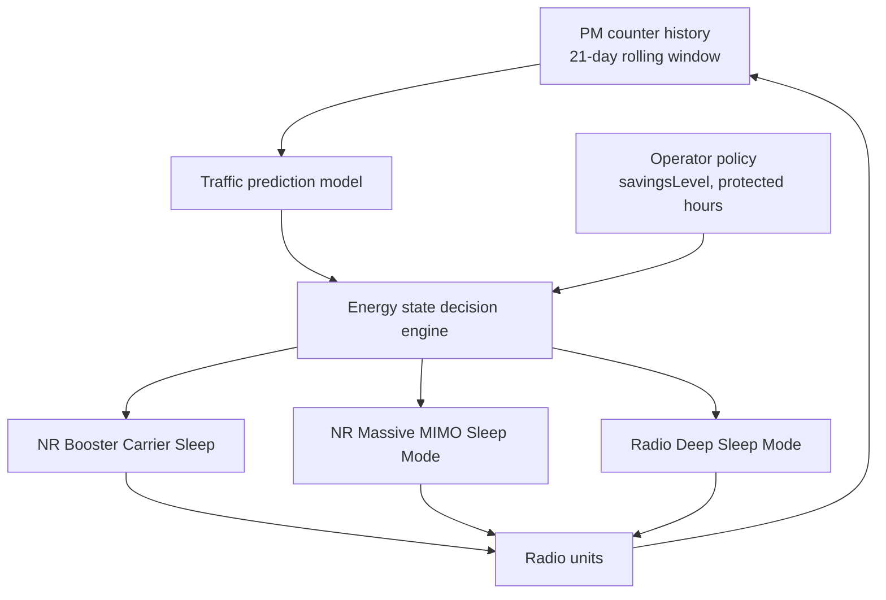

This section provides an overview of the Automated Energy Saver feature, a node-level orchestration layer for gNodeB energy-saving functions within the Automated Energy Saver document.

## Overview

Automated Energy Saver provides a node-level orchestration layer for individual energy-saving functions available in the gNodeB. Rather than requiring the operator to hand-tune thresholds and time windows for each energy feature on each cell, this feature continuously builds a per-cell traffic prediction model and uses it to arm, tune, and sequence underlying energy savers — such as:
- NR Booster Carrier Sleep
- NR Massive MIMO Sleep Mode
- Radio Deep Sleep Mode
- NR Micro Sleep Tx

This ensures the deepest safe saving level is applied at every point of the day without operator intervention.

## Feature Coordination and Decision Hierarchy

The primary problem addressed by Automated Energy Saver is coordination among interacting energy features:
- **Threshold Interaction**: A booster carrier sleeping too early can push load onto the coverage carrier, preventing the coverage carrier from falling below its sleep-entry threshold.
- **Metric Alteration**: A Massive MIMO cell entering partial sleep alters PRB utilization figures that a radio deep-sleep decision would otherwise rely on.

Automated Energy Saver resolves these interactions by owning the decision hierarchy:
1. **Load Pattern Learning**: Learns each cell's diurnal load pattern from Performance Management (PM) counter history using a rolling 21-day window with weekday/weekend separation.
2. **Traffic Forecasting**: Forecasts load for the next decision interval.
3. **Target State Computation**: Computes a target energy state per cell and per radio.
4. **Execution**: Individual features execute state transitions through their normal mechanisms, keeping all protective behaviors (such as emergency-call blocking and wake-up guarantees) in force.

## Architecture Flowchart

## Operator Policy Control and Field Savings

Operators retain policy control through a minimal set of parameters:
- **savingsLevel**: Overall savings ambition level.
- **Protected hours**: A list of protected hours during which no automated action is taken.
- **Per-cell opt-out**: Configuration to exclude specific cells from automated control.

In field deployments, automated coordination typically yields 5–15% additional site energy saving compared to statically configured individual features, primarily because sleep windows are extended into shoulder hours left untouched by static time-of-day settings.

# Cross-References

- [Feature Operation](feature-operation.md)
- [Parameters](parameters.md)
- [Performance Management](performance-management.md)
- [Feature Dependencies](feature-depedencies.md)
