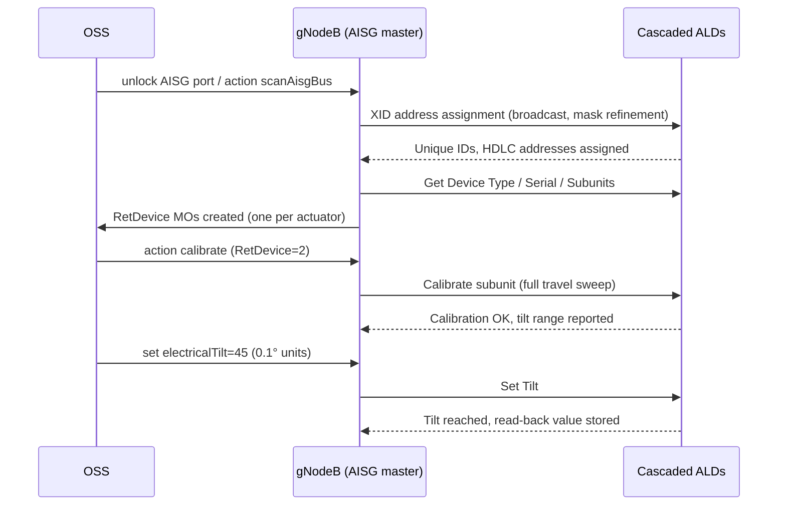

The **Cascaded RET Support** feature operation details how the gNodeB (AISG master) discovers, addresses, calibrates, and supervises cascaded Antenna Line Devices (ALDs) over the AISG bus. 

### Bus Scanning and Device Discovery

When a RET-capable port is unlocked, the node initiates the AISG device-scan state machine:

1. **XID Address Assignment**: The node broadcasts an Exchange Identifier (XID) address-assignment frame.
2. **Collision Resolution**: It collects unique-ID responses from all unaddressed devices. Collisions are resolved using mask refinement.
3. **HDLC Address Assignment**: The node assigns a distinct High-Level Data Link Control (HDLC) address to each ALD.
4. **Device Capability Assessment**: For each discovered device, the node reads the device type, vendor code, serial number, and number of subunits (multi-RET actuators expose one subunit per drivable array).
5. **MO Creation**: The node instantiates or matches a `RetDevice` Managed Object (MO) for each discovered actuator.

### Calibration and Tilt Control

* **Calibration**: After discovery, each actuator must undergo calibration exactly once before accepting any tilt commands. This procedure involves a full-travel sweep that lets the actuator learn its mechanical end stops.
* **Tilt Setting**: Tilt values are configured in units of 0.1 degrees within the device-reported mechanical range. When a command is issued, the node sets the tilt, and once reached, stores the read-back value.

### Device Supervision and Alarm Handling

The node continuously monitors each device using a keep-alive poll. If a device stops responding:
* An ALD supervision alarm is raised.
* The alarm identifies the exact position of the faulty device within the physical cascade. This precise identification facilitates quicker troubleshooting and fault localization on shared-antenna sites.

# Cross-References

* [Feature Overview](feature-overview.md) — For a high-level overview of the cascaded RET architecture.
* [Parameters](parameters.md) — For parameters and Managed Objects associated with RET devices.
* [Activation Procedure](activation-procedure.md) — For instructions on activating the AISG bus scanning and port configuration.
