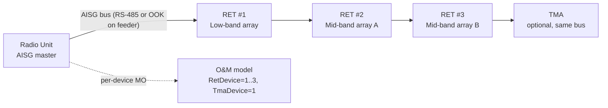

The **Cascaded RET Support** feature extends the node's Remote Electrical Tilt (RET) control capability to antenna installations where multiple RET motor units are daisy-chained on a single Antenna Interface Standards Group (AISG) bus. This stands in contrast to topologies where each RET unit requires a dedicated control port.

## Physical Topology & Background

On multi-band macro sites, cascading is the dominant physical topology. A single antenna radome frequently houses two to six independently tiltable arrays (for example, a low-band array plus two mid-band arrays). To minimize feeder and connector count, site installers typically connect all RET actuators in a cascade on a single AISG control cable.

Without cascade support:
* The node can only address the first RET unit on the bus.
* The remaining actuators are invisible to Operation and Maintenance (O&M) and can only be adjusted manually by a technician at the site using a portable controller.

With **Cascaded RET Support** activated:
* The node performs AISG v2.0/v3.0 device scanning on each RET-capable port.
* It discovers every Antenna Line Device (ALD) on the chain using a unique HDLC address assignment procedure.
* It creates one manageable `RetDevice` Managed Object (MO) instance per discovered actuator.
* Each actuator can then be calibrated, tilted, and supervised individually from the Operation Support System (OSS), exactly as if it were connected point-to-point.

### Transport Options

The AISG bus is carried using one of two supported transport variants:
1. **Dedicated multi-core control cable** (RS-485 layer).
2. **OOK (On-Off Keying) signal** modulated onto the antenna feeder, injected by a smart bias-tee in the radio unit.

Mixed chains—where the first device is connected via feeder-modem and subsequent devices are daisy-chained on RS-485—are handled transparently.

## Cascade Architecture Topology

## Operational Value

The practical value of this feature is operational:
* **Optimization Campaigns:** Tilt optimization campaigns (whether manual or driven by self-organizing networks (SON)/automated coverage optimization) can address every array on every site from the network management layer.
* **Supervision and Status:** Provides per-device calibration status, alarm supervision, and tilt read-back.
* **Capacity and Constraints:** Supports a cascade of up to 12 ALDs per port. The total bus current budget is enforced by the radio unit hardware.

# Cross-References

* [FEATURE DEPEDENCIES](feature-depedencies.md)
* [FEATURE OPERATION](feature-operation.md)
* [NETWORK IMPACT](network-impact.md)
* [PARAMETERS](parameters.md)
* [PERFORMANCE MANAGEMENT](performance-management.md)
* [ACTIVATION PROCEDURE](activation-procedure.md)
* [DEACTIVATION PROCEDURE](deactivation-procedure.md)
