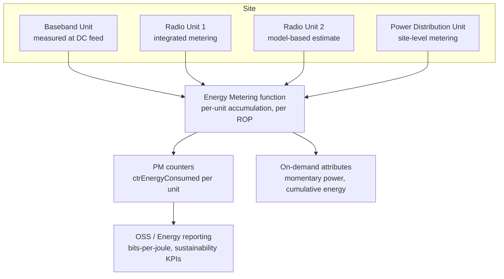

The Energy Metering feature provides standardized, per-unit measurement and reporting of electrical energy consumption across radio site equipment managed by a node. This section outlines the feature's core capabilities, measurement methodology, hardware-dependent accuracy, and its role as a foundation for energy efficiency functions.

## Core Capabilities

Energy Metering enables per-unit measurement of the electrical energy consumed by:
* **Baseband units**
* **Radio units** (including Active Antenna System (AAS) radios)
* **Enclosure infrastructure**
* **Site-level equipment** (where supported power distribution hardware is present)

This functionality positions the RAN node as a primary data source for operator sustainability initiatives, energy cost allocation, and standardized energy-efficiency KPIs defined in **ETSI ES 202 336** and the 3GPP energy efficiency framework (**TS 28.310**).

## Measurement and Performance Management Integration

Modern radio hardware integrates power measurement circuitry at the DC feed of each unit, sampling voltage and current at sub-second resolution. 

* **Standard Operation:** Without this feature active, power data is only accessible as instantaneous diagnostics readings.
* **Integration:** Energy Metering integrates these measurements into the [Performance Management](performance-management.md) framework.
* **Granularity:** Energy in watt-hours (Wh) is accumulated per unit and per 15-minute Recording Observation Period (ROP), then aggregated at the node level.
* **Exposure:** Data is exposed via PM counters (such as `ctrEnergyConsumed` per unit) and on-demand Configuration Management (CM) attributes (for momentary power and cumulative energy).

### Measurement Accuracy

Accuracy varies depending on hardware capabilities:
* **Integrated Metering (typically ±2%):** For radio units containing built-in measurement circuitry.
* **Model-Based Estimation (typically ±5%):** For older hardware lacking measurement circuitry, where consumption is calculated using a pre-characterized power model.

With this feature enabled, typical site-level visibility covers **95%+** of total site RAN consumption (metered or estimated), with the remaining portion consisting of unmanaged auxiliary equipment.

## Foundation for Energy-Efficiency Features

This feature is foundational to verifying energy savings across the node. The savings claimed by other functions can only be validated against the baseline and active measurements provided by Energy Metering. These functions include:
* NR Massive MIMO Sleep Mode
* NR Booster Carrier Sleep
* Radio Deep Sleep Mode
* NR Dynamic Power Optimizer

Additionally, network-level KPIs such as bits-per-joule rely on these measurements for a trustworthy denominator. The measured data also helps recalibrate model-based savings estimates within sleep features, improving the accuracy of node-level savings dashboards.

## Functional Architecture

The flow from physical measurements to reporting systems is illustrated in the diagram below:

# Cross-References

* [Performance Management](performance-management.md) — For information on energy-related PM counters and attributes.
* [Feature Dependencies](feature-depedencies.md) — For dependencies and relationships with energy-saving features.
* [Feature Operation](feature-operation.md) — For operational characteristics and configuration.
* [Activation Procedure](activation-procedure.md) — For instructions on enabling this feature.
