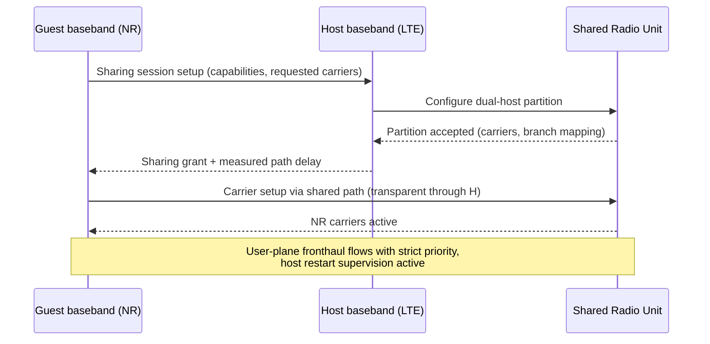

This section describes the operational mechanisms of the Fronthaul Sharing feature during integration, coordination handshake, and steady-state operation. It details how the host and guest basebands establish sharing sessions, negotiate carrier partitions, measure path delay, and maintain supervision.

## Integration and Coordination Handshake

During node integration, the hosting node discovers its fronthaul topology through standard procedures. The operator then configures the sharing arrangement:
- **Host Node Configuration:** Specific ports or radio units (RUs) are marked as shared, and the guest node identity is declared.
- **Guest Node Configuration:** Configured with a virtual fronthaul port referencing the host node.

Once the physical or logical link for the guest node is established, the host and guest nodes execute a coordination handshake consisting of the following steps:
1. **Capability Exchange:** Exchange of interface capabilities (e.g., CPRI/eCPRI types and supported rates).
2. **Delay Measurement:** Measurement of forwarding delay across the shared segment. The measured delay is reported back to both the host and guest basebands to be folded into their respective air-interface timing.
3. **Carrier Partition Agreement:** Negotiation and agreement of carrier partitions for dual-host radio units.

---

## Sequence Flow

The following sequence diagram outlines the signaling flow between the Guest baseband (NR), Host baseband (LTE), and the Shared Radio Unit during sharing session setup:

---

## Steady State and Supervision

In steady state, the sharing function acts as a transparent forwarding element with per-flow priority mapping. Supervision is continuously active in both directions:

- **Guest Supervision:** The guest node supervises the path continuity using keep-alive signaling. In the event of a path disruption, the guest node raises a specific **"shared fronthaul path failure"** alarm. This alarm is designed to point operations and maintenance (O&M) personnel directly to the host site rather than indicating a failure in the guest's own local hardware.
- **Host Supervision & Policing:** The host node supervises the guest's bandwidth usage, actively policing the guest's bandwidth allocation to protect the host's own carriers from potential misconfiguration or traffic overload.
- **User-Plane & Restart Supervision:** User-plane fronthaul flows are executed with strict priority, and host restart supervision is continuously active.

# Cross-References

- [Feature Overview](feature-overview.md)
- [Network Impact](network-impact.md)
- [Parameters](parameters.md)
- [Activation Procedure](activation-procedure.md)
