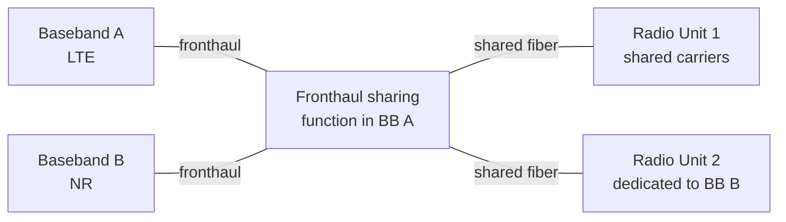

The **Fronthaul Sharing** feature allows two baseband units to share a common fronthaul infrastructure to reach radio units, eliminating the need for dedicated fiber pairs and dedicated radio ports per baseband. This feature addresses physical site constraints encountered during network evolution, such as when existing single-baseband LTE sites require the addition of an NR baseband without pulling new fiber to every radio position or performing wholesale radio replacements.

## Sharing Configurations

Two sharing arrangements are supported:

*   **Cascade Sharing:** The fronthaul link from one baseband passes through the first baseband's fronthaul switching function. This function transparently forwards traffic from the second baseband toward shared or dedicated radios on the same fiber.
*   **Radio-Port Sharing:** A multi-port radio unit terminates fronthaul links from two basebands simultaneously. The radio's carriers are partitioned between the two hosts. This arrangement pairs naturally with *NR Mixed Mode Radio for Massive MIMO* and *NR Combined Radio* for RF-side sharing.

## Transport and Multiplexing

The fronthaul transport can utilize either CPRI or eCPRI:

*   **eCPRI Sharing:** Sharing of packet-based eCPRI fronthaul supports statistical multiplexing of traffic from both basebands on the same Ethernet links. Strict priority is assigned to user-plane fronthaul flows over management traffic.
*   **Latency Budgets:** Bounded forwarding delays added by the sharing function are enforced end-to-end. The sharing function adds:
    *   **CPRI:** Under 5 µs per cascade hop.
    *   **eCPRI switching:** Under 20 µs.
    
    These delays are automatically accounted for in the node's timing advance and Time Division Duplex (TDD) switching calculations.

## Fronthaul Sharing Architecture

## Operational Advantages

By implementing Fronthaul Sharing, adding an NR overlay to an existing LTE site is simplified into a baseband-and-patch procedure rather than a full fiber installation project. This typically reduces site upgrade times from days to hours and avoids the necessity of pulling new fiber on 60–80% of upgrade candidate sites.

# Cross-References

*   [Feature Dependencies](feature-depedencies.md) — Prerequisites and system dependencies for Fronthaul Sharing
*   [Feature Operation](feature-operation.md) — Information on operational modes and deployment
*   [Network Impact](network-impact.md) — Observed impacts on network performance and signaling
*   [Parameters](parameters.md) — Configuration parameters for Fronthaul Sharing
