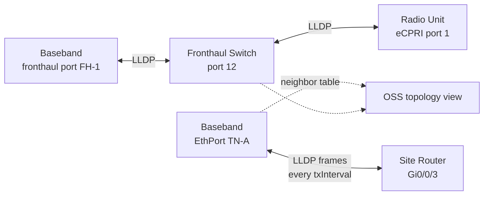

The **Link Layer Discovery Protocol (LLDP)** support feature implements the IEEE 802.1AB neighbor discovery protocol on the node's Ethernet ports. This includes both backhaul-facing transport ports and packet fronthaul ports, enabling the node to advertise its identity to directly connected equipment and learn the identity of connected far-end peers.

LLDP provides an automated solution for verifying physical cabling, helping prevent and resolve discrepancies between site documentation and actual physical connectivity.

## Core Capabilities

- **Bidirectional Advertisement**: Each enabled port periodically transmits LLDP frames and listens for advertisements from connected neighbor devices.
- **Information Exchange**: Transmitted LLDP frames carry a set of Type-Length-Value (TLV) elements containing:
  - Chassis ID
  - Port ID
  - System name and description
  - Port description
  - Management address
  - *Optional IEEE 802.3 TLVs*: Maximum frame size, link aggregation status.
- **Topology Discovery**: Received advertisements from the peer are parsed and stored in a per-port neighbor table exposed through the O&M model. The Operations Support System (OSS) can utilize this data to construct an authoritative, live Layer 2 (L2) topology map of the site and its transport attachments.

## Topology Architecture

The diagram below shows how LLDP operates across backhaul and fronthaul links to supply neighbor table data to the OSS topology view:

## Safety and Operational Benefits

- **Low Risk Profile**: LLDP is receive-safe by design. It is a one-hop, non-forwarded protocol using the link-constrained destination MAC address `01:80:C2:00:00:0E`. It carries no configuration authority and cannot alter node behavior.
- **Integration Validation**: Automated integration workflows use the LLDP neighbor data to verify that physical cabling matches the planned design before bringing up transport interfaces.
- **Fault Management**: Enables operators to quickly correlate port-down alarms with specific far-end equipment during fault escalations.

# Cross-References

- For information on parameters such as transmission intervals, see [Parameters](parameters.md).
- To understand how this feature operates and interacts with other network components, see [Feature Operation](feature-operation.md) and [Network Impact](feature-depedencies.md) (refer to [Feature Dependencies](feature-depedencies.md) for prerequisite configuration).
- To enable this feature, follow the steps in [Activation Procedure](activation-procedure.md).
