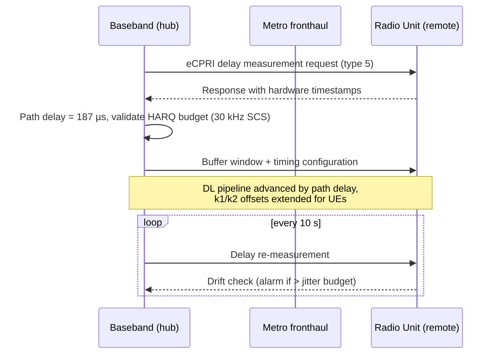

This section describes the operational mechanisms of the Long Fronthaul over eCPRI feature, outlining the delay measurement handshake, the resulting system timing adjustments, and the continuous drift monitoring process.

## Delay Measurement and Calibration

At radio setup, the baseband node establishes the static path delay and initiates continuous monitoring. This is achieved by running an eCPRI one-way delay measurement handshake against each Radio Unit (RU) using the **eCPRI delay measurement service (message type 5)**.

The measured path delay is used to calibrate and apply three specific timing adjustments:
*   **Downlink Processing Pipeline:** The downlink processing pipeline is advanced, ensuring that IQ data arrives at the radio unit just-in-time for over-the-air transmission.
*   **Uplink Combining Deadline:** The uplink combining deadline is relaxed correspondingly to account for the transmission path delay.
*   **HARQ Feedback Timing:** The Hybrid Automatic Repeat Request (HARQ) feedback timing ($k_1$/$k_2$ offsets signaled to UEs per 3GPP TS 38.213) is selected to close the loop within the extended Round-Trip Time (RTT).

## Delay Measurement Sequence

The sequence below illustrates the initial handshake, timing configuration, and the periodic in-service monitoring loop.

## Continuous Monitoring and Drift Handling

Once in service, the node repeats the eCPRI delay measurement every **10 seconds** to detect any transmission path changes. 

If a path drift beyond the configured tolerance occurs—such as when transport re-routing takes place (e.g., an optical protection switch onto a longer path)—the node triggers immediate re-validation:
*   **Within Budget:** If the newly measured delay still fits within the overall timing budget, the system timing parameters are re-adjusted seamlessly.
*   **Exceeding Budget:** If the new delay exceeds the maximum timing budget, the affected cells are gracefully barred, and a `"fronthaul delay budget exceeded"` alarm is raised. This action prevents silent corruption of the air interface.

# Cross-References

* [Feature Overview](feature-overview.md) — For the high-level context of the Long Fronthaul over eCPRI feature.
* [Feature Dependencies](feature-depedencies.md) — For hardware and software dependencies required to run these operations.
* [Parameters](parameters.md) — For details on configured tolerances and jitter budget settings.
