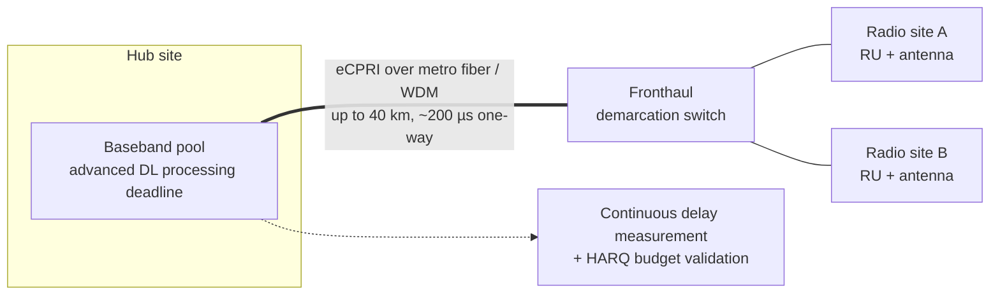

This section provides an overview of the "Long Fronthaul over eCPRI" feature, describing its purpose, architectural impact, technical mechanisms, and operational benefits.

## Overview

Conventional RAN deployments co-locate baseband and radio units within a range of a few hundred meters to ~10 km. The **Long Fronthaul over eCPRI** feature extends this supported distance up to **40 km of fiber**. It utilizes packet-based eCPRI fronthaul characterized by:
*   Extended delay compensation
*   Adaptive buffer management
*   Tightened synchronization supervision

This capability enables **Centralized RAN (C-RAN)** architectures, allowing baseband capacity to be pooled in a centralized hub location (such as an exchange building, central office, or metro data center) while radio units remain distributed at antenna sites, connected via dark fiber or wavelengths in a metro optical network.

## Technical Mechanisms & Latency Constraints

Because of the physical properties of optical fiber, extending fronthaul distance requires active management rather than just using higher-power optical transceivers. 

*   **Functional Split:** The feature uses the intra-PHY functional split 7.2x (as defined in O-RAN terminology), where frequency-domain IQ data is transmitted across the fronthaul.
*   **Latency Budget:** The air interface's Hybrid Automatic Repeat Request (HARQ) timing imposes a strict upper bound on the total round-trip processing time.
*   **Propagation Delay:** Signal propagation through fiber adds approximately **5 µs of delay per kilometer in each direction**. At 40 km, propagation alone consumes ~200 µs of the one-way delay.
*   **Re-budgeting:** To accommodate this propagation latency, the baseband's processing pipeline must be scheduled earlier relative to the air-interface frame timing. 

To achieve this, the feature:
1.  Continuously measures the per-radio path delay.
2.  Extends the transmit-side buffering window.
3.  Advances the downlink processing deadline.
4.  Validates that the resulting configuration successfully closes the HARQ timing loop for the active numerology and TDD pattern.

## Operational Benefits

Baseband pooling yields substantial operational advantages:
*   **Pooling Gains:** Consolidating baseband units into fewer, larger equipment rooms typically provides 20% to 30% capacity utilization gains for mixed residential/business traffic profiles.
*   **Simpler Logistics:** Sparing is simplified and software feature rollouts are accelerated.
*   **Reduced Footprint:** Distributed radio sites are simplified, requiring only power, antennas, and a fiber termination.

# Cross-References

*   [Feature Dependencies](feature-depedencies.md) - Pre-requisites and system requirements for long fronthaul
*   [Feature Operation](feature-operation.md) - Operational mechanisms, measurements, and delay calculations
*   [Network Impact](network-impact.md) - Effects on network capacity, performance, and key performance indicators (KPIs)
*   [Parameters](parameters.md) - Configuration parameters controlling delay compensation and buffer settings
*   [Performance Management](performance-management.md) - Performance counters and monitoring tools for fronthaul quality
*   [Activation Procedure](activation-procedure.md) - Steps to enable and configure the long-fronthaul feature
