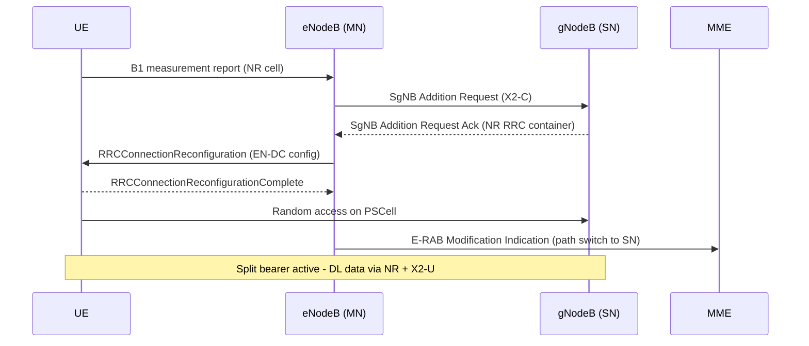

This section provides an overview of LTE-NR Dual Connectivity (EN-DC) architecture, protocol signalling, bearer configurations, and procedures in Non-Standalone (NSA) 5G network deployments.

## Overview and Network Architecture

LTE-NR Dual Connectivity introduces E-UTRA–NR Dual Connectivity (EN-DC) as specified in 3GPP TS 37.340. It allows a User Equipment (UE) to be simultaneously connected to an LTE eNodeB acting as the Master Node (MN) and an NR gNodeB acting as the Secondary Node (SN).

Key features of this architecture include:
* **Deployment Mode:** Foundational feature of Non-Standalone (NSA) 5G deployments.
* **Control Plane:** The LTE anchor carries the control plane toward the Evolved Packet Core (EPC) over the S1-MME interface.
* **User Plane Capacity:** The NR leg adds user-plane capacity, boosting per-UE throughput typically by a factor of 2–10 depending on the NR carrier bandwidth.

## Signalling and SgNB Addition Procedure

From a protocol perspective, the feature implements the SgNB Addition, Modification, and Release procedures over the X2-C interface, extended with the EN-DC signalling defined in 3GPP TS 36.423.

The procedure operates as follows:
1. **UE Capability & Indication:** An EN-DC-capable UE indicates capability via the `dcNR` bit in UE capability signalling, and upper-layer indication is provided in SIB2.
2. **Measurement Configuration:** When the UE attaches to an anchor LTE cell, the eNodeB configures a B1 measurement on the configured NR Absolute Radio Frequency Channel Number (ARFCN).
3. **Triggering SgNB Addition:** Once the UE reports an NR cell above the configured RSRP entry threshold, the eNodeB initiates SgNB Addition over X2-C.
4. **Container & RRC Reconfiguration:** The gNodeB allocates a Primary SCG Cell (PSCell), builds the NR `RRCReconfiguration` container (3GPP TS 38.331), and returns it embedded in the LTE `RRCConnectionReconfiguration`.
5. **Access & Bearer Activation:** The UE performs random access toward the PSCell, and the split or SN-terminated bearer becomes active.

### SgNB Addition Sequence Diagram

## Bearer Architecture

The default bearer architecture is the **SN-terminated split bearer**:
* **S1-U Path Switch:** The S1-U tunnel for the selected E-RAB is moved to the gNodeB.
* **Downlink Traffic:** The gNodeB Packet Data Convergence Protocol entity (NR PDCP, 3GPP TS 38.323) distributes downlink data between the NR leg and the X2-U leg toward the eNodeB.
* **Uplink Traffic:** Uplink data is routed on the NR leg only by default, unless LTE-NR Uplink Aggregation is activated.

## Additional Operational Features

The feature also covers:
* **Release Handling:** SgNB-initiated release on NR coverage loss (SCG failure handling per 3GPP TS 37.340 section 7.7).
* **PSCell Mobility:** PSCell change within the gNodeB.
* **Key Derivation:** Secondary node key ($\text{S-K}_{\text{gNB}}$) derivation and refresh.

# Cross-References

* [FEATURE DEPEDENCIES](feature-depedencies.md)
