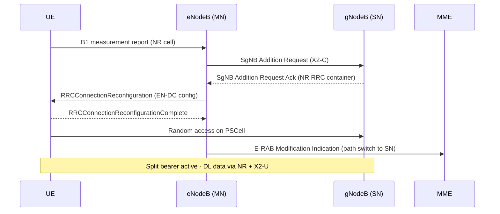

This section provides a high-level overview of LTE-NR Dual Connectivity (EN-DC), describing its non-standalone (NSA) architecture, signaling protocols, bearer architecture, setup procedure, and key lifecycle operations.

## Architecture and Signalling

LTE-NR Dual Connectivity introduces E-UTRA–NR Dual Connectivity (EN-DC) as specified in 3GPP TS 37.340. It allows a UE to be simultaneously connected to an LTE eNodeB acting as Master Node (MN) and an NR gNodeB acting as Secondary Node (SN).

- **Deployment Model:** Foundational feature of Non-Standalone (NSA) 5G deployments.
- **Control Plane:** The LTE anchor carries the control plane toward the EPC over S1-MME.
- **User Plane:** The NR leg adds user-plane capacity, typically boosting per-UE throughput by a factor of 2–10 depending on the NR carrier bandwidth.
- **Protocol Interface:** Implements SgNB Addition, Modification, and Release procedures over the X2-C interface, extended with EN-DC signalling defined in TS 36.423.

## SgNB Addition Procedure

1. **UE Capability & Indication:** An EN-DC-capable UE indicates support via the `dcNR` bit in UE capability signalling and receives the upper-layer indication in SIB2 upon attaching to an anchor LTE cell.
2. **Measurement Configuration:** The eNodeB configures a B1 measurement on the configured NR ARFCN.
3. **Trigger:** The UE reports an NR cell above the configured RSRP entry threshold.
4. **SgNB Addition:**
   - The eNodeB initiates SgNB Addition.
   - The gNodeB allocates a PSCell, builds the NR `RRCReconfiguration` container (TS 38.331), and returns it embedded in the LTE `RRCConnectionReconfiguration`.
5. **Activation:** The UE performs random access toward the PSCell, and the split or SN-terminated bearer becomes active.

## Bearer Architecture

- **Default Architecture:** The default bearer architecture is the SN-terminated split bearer.
- **Downlink Data:** The S1-U tunnel for the selected E-RAB is moved to the gNodeB, whose PDCP entity (NR PDCP, TS 38.323) distributes downlink data between the NR leg and the X2-U leg toward the eNodeB.
- **Uplink Data:** Uplink is by default routed on the NR leg only, unless LTE-NR Uplink Aggregation is activated.

## Signalling Flow

## Additional Features

The feature also covers:
- SgNB-initiated release on NR coverage loss (SCG failure handling per TS 37.340 section 7.7).
- PSCell change within the gNodeB.
- Secondary node key (S-KgNB) derivation and refresh.

# Cross-References

- [FEATURE DEPEDENCIES](feature-depedencies.md)
