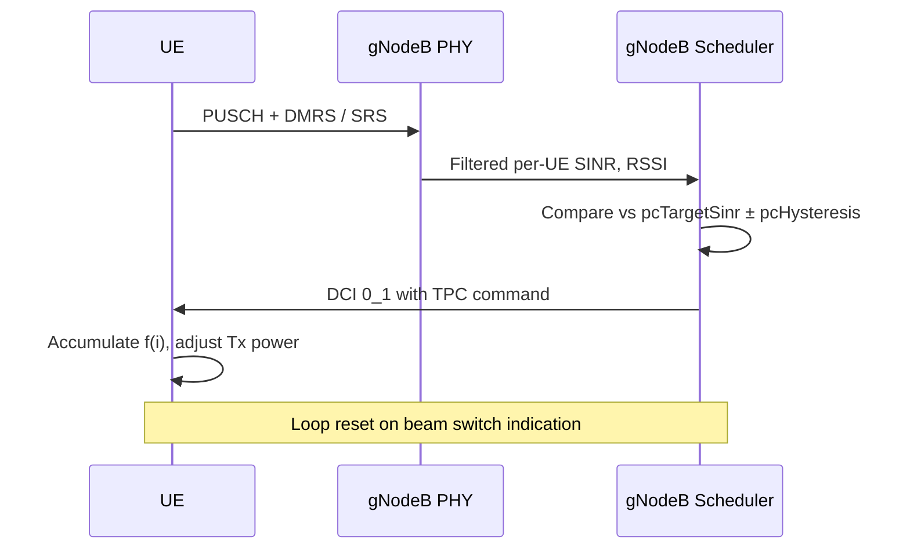

For each RRC-connected UE with an active FR2 serving cell, the scheduler maintains a per-carrier closed-loop state f(i) as defined in TS 38.213 clause 7.1. Every scheduling occasion, the uplink SINR estimator produces a filtered per-UE SINR based on PUSCH DMRS and periodic SRS. The controller compares this against `pcTargetSinr` with a hysteresis window of `pcHysteresis` dB. If the measured value is outside the window, a TPC command of ±1 dB (or +3 dB for fast ramp-up after blockage recovery) is embedded in the next uplink DCI. Commands accumulate at the UE, moving its operating point.

A blockage-recovery mechanism detects a sudden SINR drop of more than `blockageDetectThr` dB and temporarily authorizes +3 dB steps until the target window is re-entered, shortening recovery from hand or body blockage from seconds to a few hundred milliseconds.

# Cross-References

- [FEATURE OVERVIEW](feature-overview.md)
- [PARAMETERS](parameters.md)
