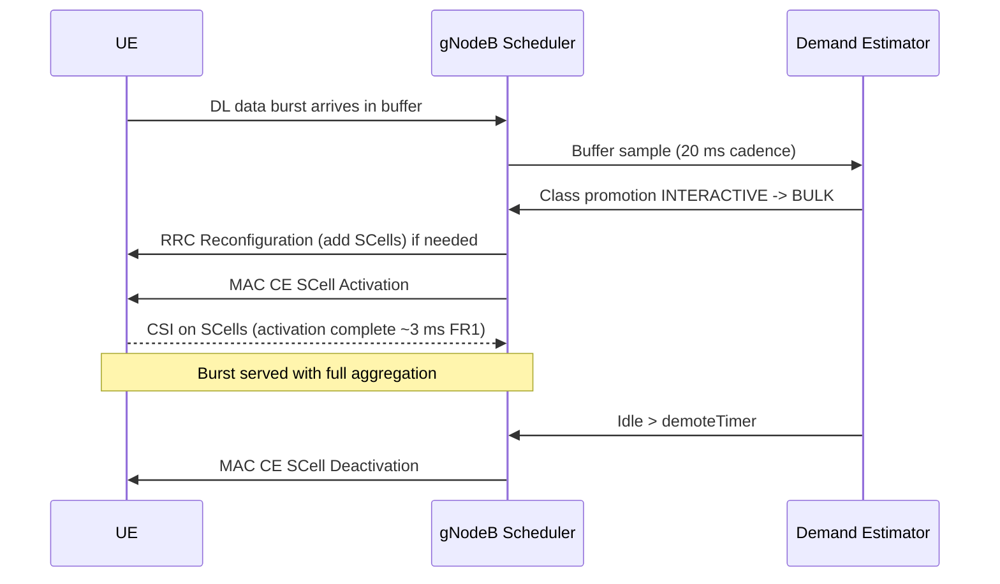

This section describes the operational mechanisms of the Data-Aware Carrier Management feature, including UE demand estimation sampling, threshold-driven class transitions, and associated SCell signaling.

## Demand Estimation and Classification

The demand estimator samples each UE every 20 ms and maintains an exponentially weighted average of:
- Downlink and uplink buffer occupancy
- Size of the last N data bursts
- Inter-burst idle time

Classification thresholds `bulkBurstThr` and `interactiveBurstThr` map these observations to demand classes. Hysteresis is controlled by `classDwellTimer` to prevent oscillation.

## SCell Lifecycle and Signaling

* **Promotion to BULK:** On promotion to `BULK`, the scheduler issues SCell Activation MAC CEs for all configured SCells. If SCells are not yet configured, an RRC Reconfiguration adding them is issued (TS 38.331).
* **Demotion and De-configuration:** On sustained inactivity beyond `demoteTimer`, SCells are deactivated first. After a further duration defined by `deconfigTimer`, SCells are de-configured, returning the UE to a lean PCell-only configuration.

## Sequence Flow

# Cross-References

- [Parameters](parameters.md)
- [Activation Procedure](activation-procedure.md)
- [Deactivation Procedure](deactivation-procedure.md)
