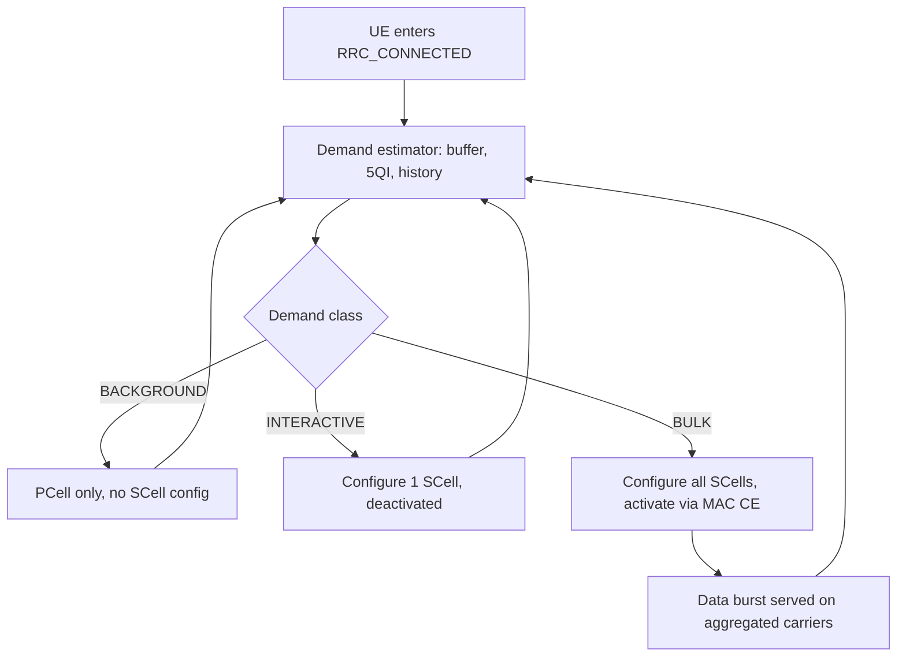

This section provides an overview of the Data-Aware Carrier Management feature for NR carrier aggregation in the gNodeB.

## Overview

Data-Aware Carrier Management makes secondary cell (SCell) configuration and activation decisions in NR carrier aggregation dependent on the actual and predicted data demand of each UE, instead of configuring SCells statically for every CA-capable UE at connection setup. 

In a conventional CA implementation, a CA-capable UE entering `RRC_CONNECTED` is immediately configured with the full set of candidate SCells, and those SCells are activated on a simple buffer threshold. While this maximizes peak throughput readiness, it introduces inefficiencies:
* A UE exchanging keep-alive traffic or a short web transaction incurs SCell measurement configuration costs, activation delay, and increased UE battery drain.
* The gNodeB spends Physical Downlink Control Channel (PDCCH) capacity and RRC signaling on carriers the UE will never fill.

## Per-UE Demand Estimator and Classification

The feature introduces a per-UE demand estimator within the gNodeB that observes:
* Downlink and uplink buffer dynamics
* Historical burst sizes
* PDU session 5QI mix
* Short-term throughput

Based on these inputs, each UE is classified into demand classes:

| Demand Class | SCell Configuration and Activation Behavior |
| :--- | :--- |
| **BACKGROUND** | UE remains on the PCell only (no SCell configuration). |
| **INTERACTIVE** | UE is configured with a single fast-activating SCell (deactivated). |
| **BULK** | Immediate configuration and activation of all applicable SCells. |

The classification is re-evaluated continuously. If a UE starts a large download, it is promoted within tens of milliseconds using MAC Control Element (MAC CE)-based SCell activation as per 3GPP TS 38.321.

## Key Benefits and Net Effects

* **30–50% fewer SCell activations** network-wide.
* **Negligible loss of user throughput** (typically under 2% at the 90th percentile).
* **Reduced RRC reconfiguration volume**.
* **Lower UE energy consumption**.
* **Freed PDCCH and CSI resources** on SCell carriers, allocating capacity to UEs that require it.

## Decision Flow Diagram

# Cross-References

* [FEATURE OPERATION](feature-operation.md)
* [ACTIVATION PROCEDURE](activation-procedure.md)
* [DEACTIVATION PROCEDURE](deactivation-procedure.md)
* [NETWORK IMPACT](network-impact.md)
