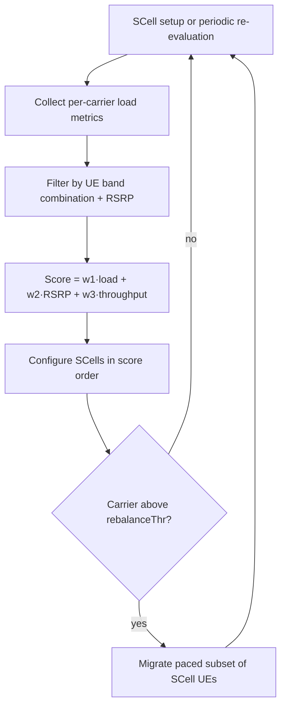

This section provides an overview of the Dynamic Component Carrier Management feature within the overall document structure.

## Feature Summary

Dynamic Component Carrier Management automates the selection, prioritization, and load-driven redistribution of component carriers across the Carrier Aggregation (CA) capable User Equipment (UE) population of a node. 

In a statically configured network, each cell carries an operator-defined Secondary Cell (SCell) candidate list with fixed priorities, steering every CA-capable UE toward the same carriers in the same order. Static priorities cannot adapt when traffic load shifts across carriers (for example, a mid-band capacity layer congested at peak hours while an adjacent low-band carrier is underutilized), requiring operators to either over-dimension capacity or accept unbalanced carrier loading.

This feature replaces static candidate lists with dynamic, per-UE carrier assignments calculated at SCell setup time and re-evaluated periodically.

## Dynamic Carrier Assignment and Scoring

The carrier manager gathers per-carrier load metrics and combines them with per-UE inputs to compute a composite score for each candidate carrier. SCells are then configured in order of score.

* **Per-Carrier Load Metrics:**
  * Physical Resource Block (PRB) utilization
  * Active UE count
  * Physical Downlink Control Channel (PDCCH) utilization
  * Average achieved throughput per scheduled UE
* **Per-UE Inputs:**
  * Band-combination capability
  * Measured Reference Signal Received Power (RSRP) per candidate carrier
  * Current traffic demand

## Background Load Rebalancing

A background rebalancing process actively manages long-lived high-volume UEs (typically Fixed Wireless Access / FWA):
* Identifies carriers crossing a sustained-load threshold (`rebalanceThr`).
* Migrates SCells of high-volume UEs away from heavily loaded carriers.
* Uses SCell release/add reconfigurations paced to prevent signaling bursts.

## Observed Performance Impact

Operators typically observe the following performance improvements on multi-carrier sites:
* **10–25% higher aggregate downlink throughput** during busy hours.
* **Visible reduction in load spread** across carriers, with the standard deviation of PRB utilization across carriers commonly halving.
* **Reduction in congestion-related scheduling delays** on the previously default-first carrier.

## Feature Workflow

