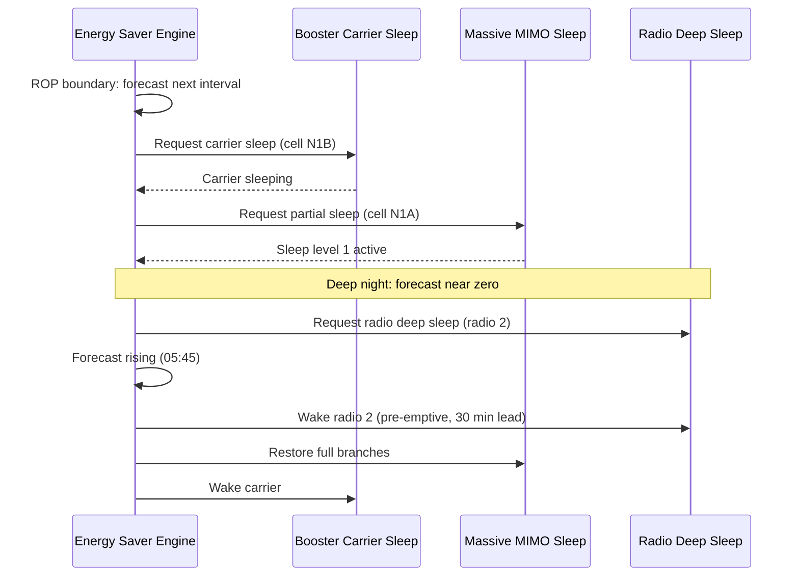

This section describes the operational mechanics of the Automated Energy Saver feature, including its decision interval, load forecasting model, policy margins, and feature state transition sequencing.

## Decision Engine and Load Forecasting

The decision engine runs every 15 minutes, aligned to the ROP boundary. For each cell, it generates a load forecast for the upcoming interval expressed as:

- Expected PRB utilization
- Expected RRC-connected users

## Target Energy State Mapping and Policy Margins

The load forecast is mapped to a target energy state using the operator's `savingsLevel` policy. The policy determines the statistical margin added to the forecast to keep load below the subordinate feature's entry threshold:

| Policy Setting | Statistical Margin | Condition |
| :--- | :--- | :--- |
| **CONSERVATIVE** | 3-sigma margin | Forecast + 3-sigma margin must stay below subordinate entry threshold |
| **BALANCED** | 2-sigma margin | Forecast + 2-sigma margin must stay below subordinate entry threshold |
| **AGGRESSIVE** | 1-sigma margin | Forecast + 1-sigma margin must stay below subordinate entry threshold |

## Feature Execution Sequence

State requests are issued to subordinate features in a fixed order to ensure capacity management:

- **Sleep Order (Top-Down):**
  1. Booster carriers
  2. Massive MIMO branch sleep
  3. Radio deep sleep
- **Wake-up Order (Bottom-Up):**
  1. Radio deep sleep
  2. Massive MIMO branch sleep
  3. Booster carriers

Restoring capacity bottom-up ensures network capacity is available before load increases require it.

## Operational Sequence

## Pre-emptive Wake-up

Wake-up requests are issued pre-emptively ahead of the forecast load rise using a configurable lead time (`wakeupLeadTime`). This pre-emptive action eliminates reactive wake-up latency from subordinate features during load ramp periods (such as the morning ramp), preventing user experience degradation.

# Cross-References

- [Feature Overview](feature-overview.md)
- [Parameters](parameters.md)
