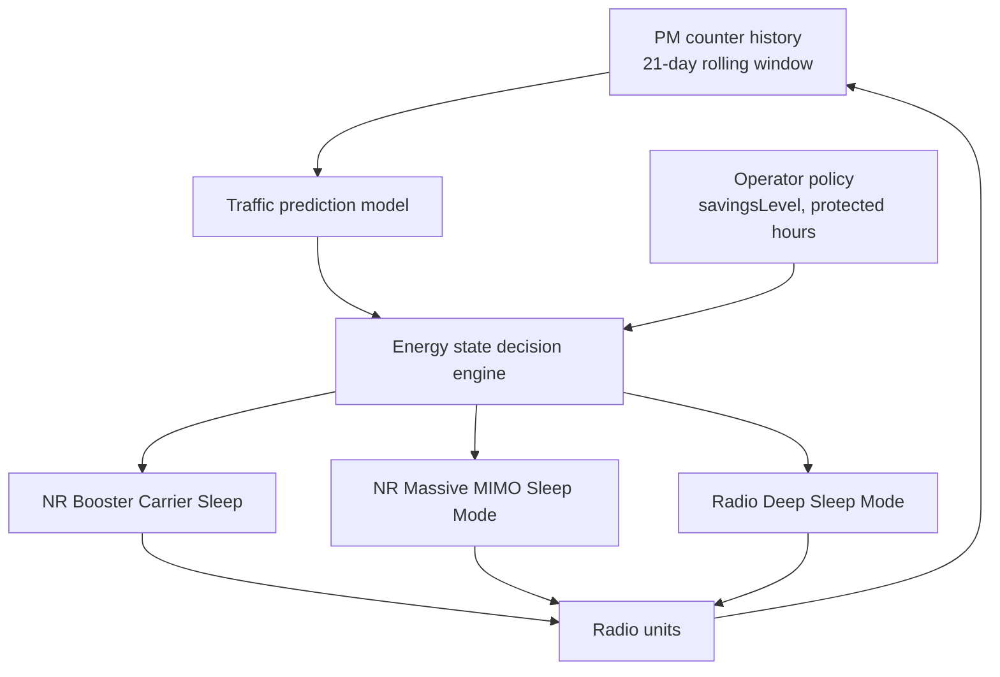

The **Feature Overview** section describes the Automated Energy Saver functionality within the gNodeB, outlining its orchestration role across individual energy-saving features, its underlying decision hierarchy, and operator control mechanisms.

## Node-Level Orchestration

Automated Energy Saver provides a node-level orchestration layer for individual energy-saving functions in the gNodeB. Rather than requiring the operator to hand-tune thresholds and time windows for each energy feature on each cell, the feature continuously builds a per-cell traffic prediction model. It uses this model to arm, tune, and sequence underlying energy savers:

- **NR Booster Carrier Sleep**
- **NR Massive MIMO Sleep Mode**
- **Radio Deep Sleep Mode**
- **NR Micro Sleep Tx**

By orchestrating these features, Automated Energy Saver applies the deepest safe energy saving level at every point of the day without operator intervention.

## Coordination and Decision Hierarchy

Individual energy-saving features are locally safe, but their thresholds interact:
- A booster carrier sleeping too early pushes its load onto the coverage carrier, which then fails to fall below its own sleep-entry threshold.
- A Massive MIMO cell entering partial sleep changes Physical Resource Block (PRB) utilization figures that a radio deep-sleep decision relies upon.

Automated Energy Saver resolves these interactions by owning the decision hierarchy:
1. **Load Learning**: Learns each cell's diurnal load pattern from Performance Management (PM) counter history using a rolling 21-day window with weekday/weekend separation.
2. **Load Forecasting**: Forecasts load for the next decision interval.
3. **Target State Computation**: Computes a target energy state per cell and per radio.
4. **Execution**: The individual underlying features execute state transitions through their normal mechanisms, maintaining all protective behaviors (such as emergency-call blocking and wake-up guarantees).

### Control and Decision Flow

## Operator Policy Control and Field Impact

Operators retain policy control through a small set of parameters:
- **`savingsLevel`**: An overall savings ambition level.
- **Protected hours**: A list of hours during which no automated action is taken.
- **Per-cell opt-out**: Allows excluding specific cells from automated control.

In field deployments, automated coordination typically yields 5–15% additional site energy savings compared with statically configured individual features, primarily by extending sleep windows into shoulder hours left untouched by static time-of-day settings.

# Cross-References

- [Feature Operation](feature-operation.md)
- [Parameters](parameters.md)
- [Feature Dependencies](feature-depedencies.md)
