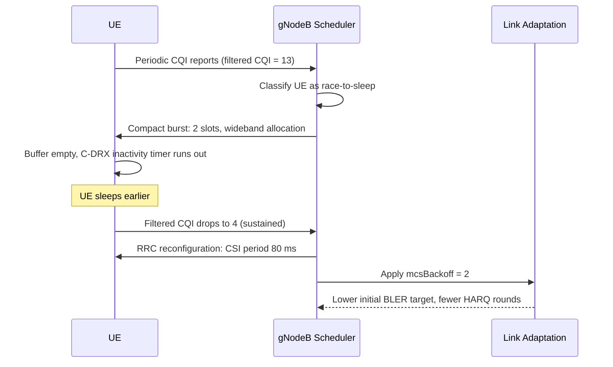

This section details the operational logic and UE classification mechanisms used by the CQI-Based UE Energy Efficiency Enhancement feature, including scheduler optimizations and link adaptation adjustments.

## UE Classification and CQI Filtering

Per connected UE, the feature maintains a smoothed wideband CQI estimate computed using an exponential filter over reported CQI values with time constant `cqiFilterTime`. Based on the filtered CQI, UEs are assigned to specific operational classes:

### Race-to-Sleep Class
UEs whose filtered CQI is at or above `highCqiThr` are placed in the race-to-sleep class:
- **Scheduling Optimization**: The gNodeB scheduler aggregates pending downlink data into the smallest number of slots allowed by buffer and PRB availability, prioritizing wideband allocations.
- **C-DRX Transition**: When the buffer empties, the scheduler immediately releases the UE toward C-DRX inactivity, allowing the UE to enter sleep mode earlier.

### Relaxed Class
UEs whose filtered CQI stays at or below `lowCqiThr` for `lowCqiHoldTimer` seconds are placed in the relaxed class:
- **CSI Reporting Frequency**: The periodic CSI report interval is reconfigured from the cell default to `relaxedCsiPeriod`.
- **Link Adaptation Back-off**: Downlink link adaptation applies a fixed back-off of `mcsBackoff` MCS indices to cut HARQ retransmission probability roughly in half.

## Class Transition Hysteresis

Class transitions incorporate hysteresis (`cqiClassHysteresis`) so that UEs on the class boundary do not oscillate between configurations, which would itself cost RRC signaling and UE energy.

## Operation Sequence

# Cross-References

- [Feature Overview](feature-overview.md)
- [Parameters](parameters.md)
