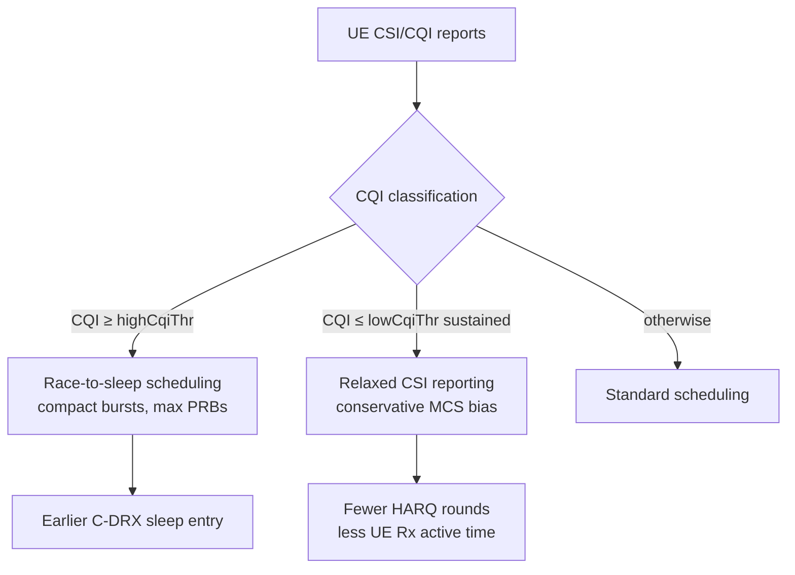

This section provides an overview of the CQI-Based UE Energy Efficiency Enhancement feature, detailing how it adapts gNodeB scheduling and link-adaptation behavior based on UE-reported Channel Quality Indicator (CQI) to reduce connected-mode battery consumption.

## Feature Description

The CQI-Based UE Energy Efficiency Enhancement feature optimizes connected-mode UE battery consumption by adapting scheduling and link-adaptation behavior according to radio conditions reported via CQI. A UE's modem energy per delivered bit varies strongly with channel quality:
* **High CQI UEs**: Can drain buffers rapidly in few slots and return to C-DRX sleep quickly.
* **Low CQI UEs**: Spend significantly more slots awake receiving low-rate transmissions and HARQ retransmissions for equivalent payload sizes.

### Core Mechanisms

The feature operates via two primary mechanisms based on CQI thresholds:

1. **CQI-Conditioned Scheduling Compaction ("Race to Sleep")**:
   * **Trigger**: UEs reporting CQI at or above a configurable threshold (`highCqiThr`).
   * **Behavior**: The scheduler prefers fewer, larger allocations (more PRBs, higher aggregation of pending data into a single transmission burst).
   * **Objective**: Minimizes active RF and baseband wake time, following the "race to sleep" strategy described in 3GPP TR 38.840.

2. **Relaxed CSI Reporting & Link-Adaptation Bias**:
   * **Trigger**: UEs persistently reporting low CQI (at or below `lowCqiThr`).
   * **Behavior**: Relaxes the CQI reporting configuration (longer periodic CSI reporting intervals per TS 38.331 `CSI-ReportConfig`) and biases link adaptation toward a slightly more conservative Modulation and Coding Scheme (MCS).
   * **Objective**: Reduces HARQ retransmission rounds that keep the UE receiver active.

Both mechanisms operate transparently to the UE beyond standard RRC reconfiguration, requiring no UE-vendor-specific behavior.

### Decision Flow

## Network and UE Impact

* **Network Side**: Minor impact, slightly increasing instantaneous PRB utilization while reducing the total number of scheduled slots per UE.
* **UE Side**: Field measurements show a 5–12% reduction in connected-mode modem energy for smartphone traffic mixes, with maximum gains observed for bursty applications on cells with favorable CQI distributions.
* **Complementary Features**: Complements Connected Mode DRX and NR Service-Adaptive DRX. While DRX controls the sleep opportunity, this feature shortens the awake time required per data burst.

# Cross-References

* [Feature Operation](feature-operation.md)
* [Parameters](parameters.md)
* [Network Impact](network-impact.md)
