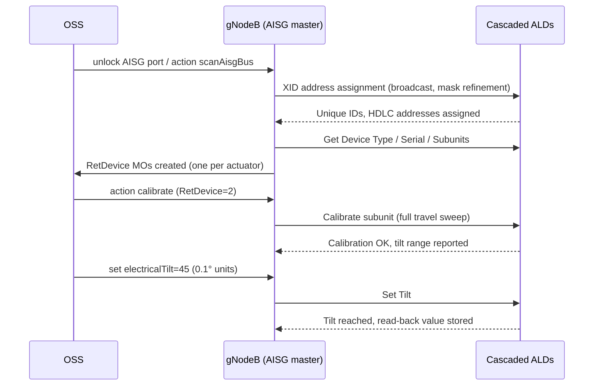

This section details the operational workflow for the Cascaded RET Support feature, describing the sequence from AISG bus scanning and device discovery through calibration, electrical tilt control, and continuous device supervision.

## Bus Scanning and Device Discovery

Operation begins with bus scanning. When a RET-capable port is unlocked, the node runs the AISG device-scan state machine through the following process:

1. **Address Assignment**: The node broadcasts an XID address-assignment frame and collects unique-ID responses from all unaddressed devices.
2. **Collision Resolution**: Collisions are resolved using mask refinement, after which each ALD is assigned a distinct HDLC address.
3. **Device Identification**: For each discovered device, the node reads:
   - Device type
   - Vendor code
   - Serial number
   - Number of subunits (multi-RET actuators expose one subunit per drivable array)
4. **MO Instantiation**: The node instantiates or matches a `RetDevice` Managed Object (MO).

## Operation Sequence

## Calibration, Tilt Control, and Supervision

- **Calibration**: After discovery, each actuator must be calibrated once via a full-travel sweep (allowing the actuator to learn its mechanical end stops) before any tilt commands are accepted.
- **Electrical Tilt Adjustment**: Tilt is set in 0.1-degree units within the range reported by the device.
- **Continuous Supervision**: The node continuously supervises each device with a keep-alive poll. If a device stops responding, an ALD supervision alarm is raised identifying the exact position in the cascade, which materially shortens fault localization on shared-antenna sites.

# Cross-References

- [Feature Overview](feature-overview.md)
- [Activation Procedure](activation-procedure.md)
- [Parameters](parameters.md)
