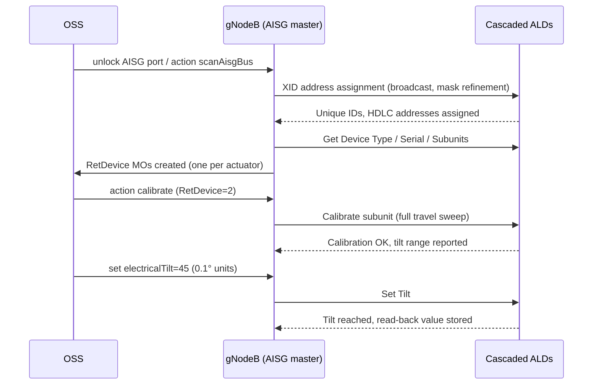

This section details the operational workflow for Cascaded RET Support, including AISG bus scanning, ALD device discovery, subunit calibration, electrical tilt configuration, and continuous keep-alive supervision.

## Operational Workflow

### Bus Scanning and Device Discovery

Operation begins with bus scanning. When a RET-capable port is unlocked, the node runs the AISG device-scan state machine:
- Broadcasts an XID address-assignment frame.
- Collects unique-ID responses from all unaddressed devices.
- Resolves collisions by mask refinement.
- Assigns each Antenna Line Device (ALD) a distinct HDLC address.

For each discovered device, the node reads the device type, vendor code, serial number, and number of subunits (multi-RET actuators expose one subunit per drivable array), then instantiates or matches a `RetDevice` Managed Object (MO).

### Message Flow

### Calibration, Tilt Control, and Supervision

- **Calibration:** After discovery, each actuator must be calibrated once via a full-travel sweep that lets the actuator learn its mechanical end stops before tilt commands are accepted.
- **Tilt Control:** Tilt is set in 0.1-degree units within the device-reported range.
- **Continuous Supervision:** The node continuously supervises each device with a keep-alive poll. A device that stops responding raises an ALD supervision alarm identifying the exact position in the cascade, shortening fault localization on shared-antenna sites.

## Cross-References

- [Feature Overview](feature-overview.md)
- [Parameters](parameters.md)
