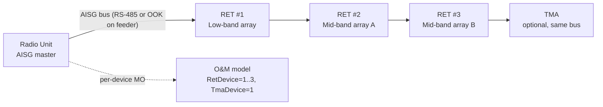

This section provides a high-level overview of the Cascaded RET (Remote Electrical Tilt) Support feature, explaining its physical topology, operational mechanism, transport variants, and practical network management value.

## Overview & Physical Topology

Cascaded RET Support extends the node's Remote Electrical Tilt (RET) control capability to antenna installations where multiple RET motor units are daisy-chained on a single AISG (Antenna Interface Standards Group) bus, rather than each RET unit having its own dedicated control port.

This arrangement represents the dominant physical topology on multi-band macro sites:
* A single antenna radome frequently houses two to six independently tiltable arrays (e.g., a low-band array plus two mid-band arrays).
* Site installers connect all RET actuators in a cascade on one AISG control cable to minimize feeder and connector count.

## Device Discovery and Management

* **Without Cascade Support:** The node can only address the first RET unit on the bus. Remaining actuators are invisible to Operation & Maintenance (O&M) and can only be tilted manually by a technician using a portable controller at the site.
* **With Cascade Support:** 
  * The node performs AISG v2.0/v3.0 device scanning on each RET-capable port.
  * Discovers every Antenna Line Device (ALD) on the chain via its unique HDLC address assignment procedure.
  * Creates one manageable `RetDevice` Managed Object (MO) instance per discovered actuator.
  * Enables each actuator to be calibrated, tilted, and supervised individually from the OSS, identically to a point-to-point connection.

## Transport Mechanisms

The AISG bus is supported across two primary physical layer transport variants:
1. **Dedicated Control Cable:** Multi-core control cable using an RS-485 layer.
2. **Feeder Modulation:** Modulated onto the antenna feeder as an On-Off Keying (OOK) signal injected by a smart bias-tee in the radio unit.

**Mixed Chains:** Systems where the first device is feeder-modem-connected and subsequent devices are daisy-chained via RS-485 are supported and handled transparently.

## Cascaded RET Bus Architecture

## Operational Capabilities and Limits

* **Operational Value:** Tilt optimization campaigns (manual or driven by SON/automated coverage optimization) can address every array on every site from the network management layer, featuring per-device calibration status, alarm supervision, and tilt read-back.
* **Capacity Limits:** A cascade of up to 12 ALDs per port is supported.
* **Power Constraints:** A total bus current budget is enforced by the radio unit hardware.

# Cross-References

* [Feature Operation](feature-operation.md)
* [Feature Dependencies](feature-depedencies.md)
* [Parameters](parameters.md)
* [Activation Procedure](activation-procedure.md)
