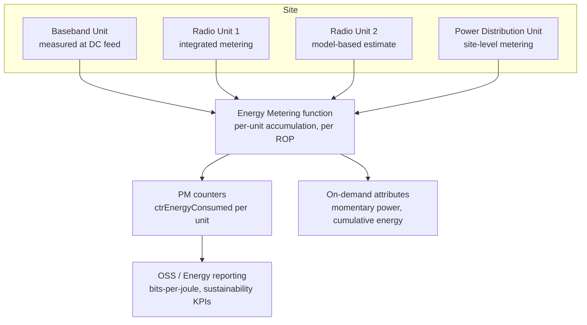

This section provides an overview of the Energy Metering feature, which enables standardized, per-unit electrical energy measurement and reporting across managed RAN site equipment.

## Feature Overview

Energy Metering provides standardized, per-unit measurement and reporting of the electrical energy consumed by the radio site equipment managed by the node:
* Baseband units
* Radio units (including Active Antenna System [AAS] radios)
* Enclosure infrastructure
* Entire site (where supported power distribution hardware is present)

The feature turns the RAN node into a data source for operator sustainability programs, energy cost allocation, and standardized energy-efficiency KPIs as defined in ETSI ES 202 336 and the 3GPP energy efficiency framework (TS 28.310).

## Hardware Integration and Measurement Accuracy

Modern radio hardware includes power measurement circuitry at the DC feed of each unit, sampling voltage and current at sub-second resolution. Without this feature, that data is only visible as instantaneous readings in hardware diagnostics. 

Energy Metering integrates these measurements into the performance management framework:
* **Energy Accumulation:** Energy (Wh) is accumulated per unit and per 15-minute Recording Period (ROP).
* **Aggregation & Exposure:** Data is aggregated per node and exposed both as PM counters (such as `ctrEnergyConsumed` per unit) and as on-demand attributes (momentary power, cumulative energy).
* **Measurement Accuracy:**
  * **±2%** for radio units with integrated metering circuitry.
  * **±5%** for units where consumption is estimated from a characterized power model (older hardware lacking dedicated measurement circuitry).

## Verification and Energy-Aware Functions

The feature serves as a foundation for the energy-efficiency feature set. Savings claimed by sleep and optimization features—such as NR Massive MIMO Sleep Mode, NR Booster Carrier Sleep, Radio Deep Sleep Mode, and NR Dynamic Power Optimizer—can only be verified against measured consumption, providing a denominator for network-level energy KPIs like bits-per-joule.

Beyond reporting, measured data feeds the node's internal energy-aware functions:
* Model-based savings estimates in sleep features are recalibrated against measured consumption.
* Typical site-level visibility achieves **95%+** of total site RAN consumption metered or estimated, with the unmonitored remainder consisting of auxiliary equipment outside node management.

## Feature Data Flow

# Cross-References

* [Feature Dependencies](feature-depedencies.md)
* [Feature Operation](feature-operation.md)
* [Performance Management](performance-management.md)
