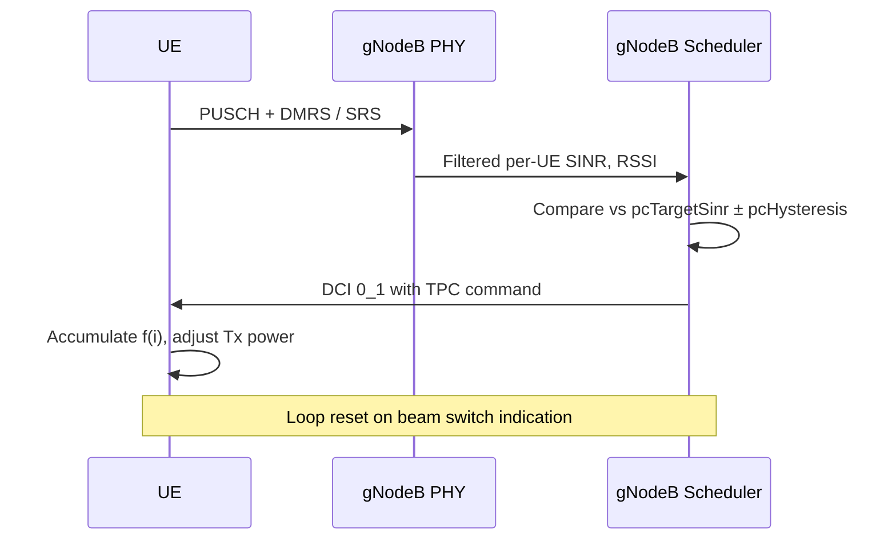

This section details the feature operation for Closed-Loop Power Control High-Band, covering per-carrier closed-loop state tracking, Transmit Power Control (TPC) command generation, and the blockage-recovery mechanism.

## Operational Overview

For each RRC-connected UE with an active FR2 serving cell, the scheduler maintains a per-carrier closed-loop state $f(i)$ as defined in TS 38.213 clause 7.1. 

On every scheduling occasion, the operation proceeds as follows:
- The uplink SINR estimator produces a filtered per-UE SINR based on PUSCH DMRS and periodic SRS.
- The controller compares this measured value against `pcTargetSinr` with a hysteresis window of `pcHysteresis` dB.
- If the measured value falls outside the window, a TPC command of $\pm 1\text{ dB}$ (or $+3\text{ dB}$ for fast ramp-up after blockage recovery) is embedded in the next uplink DCI (such as DCI 0_1).
- TPC commands accumulate at the UE, adjusting its transmit operating point.
- The loop resets upon a beam switch indication.

## Blockage Recovery

A dedicated blockage-recovery mechanism detects a sudden SINR drop of more than `blockageDetectThr` dB. Upon detection, it temporarily authorizes $+3\text{ dB}$ step increases until the target window is re-entered, shortening recovery from hand or body blockage from seconds to a few hundred milliseconds.

## Sequence Diagram

# Cross-References

- [PARAMETERS](parameters.md)
- [FEATURE OVERVIEW](feature-overview.md)
