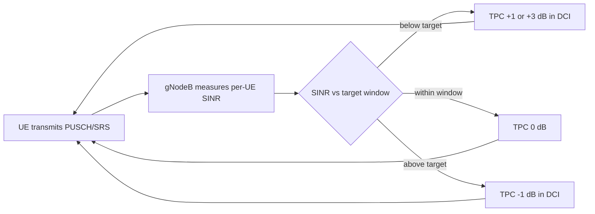

This section provides an overview of the Closed-Loop Power Control High-Band feature within the document structure.

Closed-Loop Power Control High-Band introduces network-controlled, closed-loop adjustment of UE uplink transmit power on NR high-band (FR2, mmWave) carriers operating as PCells or SCells in a carrier aggregation configuration. Without this feature, high-band uplink power is governed purely by open-loop power control: the UE estimates its pathloss from SSB or CSI-RS measurements and derives its PUSCH, PUCCH, and SRS transmit power from the broadcast p0 and alpha values as specified in TS 38.213. Open-loop control is adequate when the pathloss estimate is accurate, but on FR2 carriers the estimate is inherently noisy: beamformed links change gain abruptly when the UE or gNodeB switches beams, blockage events cause step changes of 15–25 dB, and the UE power-class limitations interact with beam-specific EIRP limits.

This feature closes the loop. The gNodeB continuously measures the received SINR and the per-UE received power on PUSCH and SRS, compares them against a configurable target, and issues Transmit Power Control (TPC) commands in DCI formats 0_1/0_2 (accumulated or absolute mode). The result is that each UE converges on the minimum transmit power that satisfies the receive target, which reduces inter-cell and inter-beam interference, improves uplink link adaptation accuracy, and extends UE battery life. In carrier aggregation deployments the benefit compounds: when several UEs aggregate high-band SCells, uncontrolled uplink power on one carrier raises the noise floor for all co-scheduled UEs on adjacent beams.

Typical measured gains are 1.5–3 dB reduction in average uplink interference-over-thermal (IoT) on loaded FR2 cells and a 10–20% improvement in uplink cell-edge throughput, because cell-edge UEs no longer compete against over-powered cell-center UEs.

### Closed-Loop Control Flow

