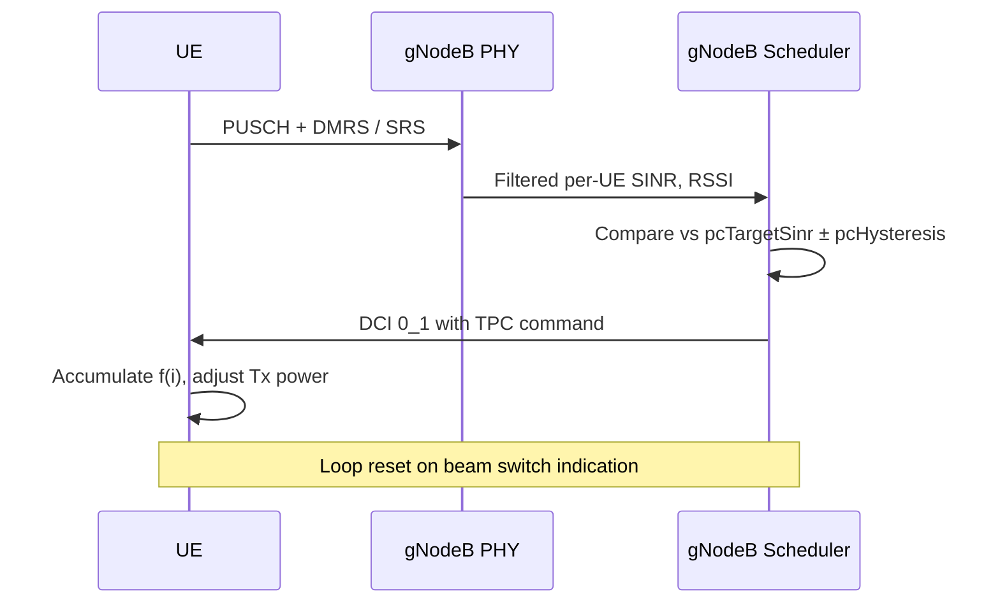

This section details the operational procedure for Closed-Loop Power Control High-Band, outlining how the gNodeB scheduler evaluates uplink SINR and issues Transmit Power Control (TPC) commands to RRC-connected UEs.

## Closed-Loop Power Control Mechanism

For each RRC-connected UE with an active FR2 serving cell, the scheduler maintains a per-carrier closed-loop state $f(i)$ as defined in TS 38.213 clause 7.1.

1. **Measurement and Filtering**: At every scheduling occasion, the uplink SINR estimator produces a filtered per-UE SINR based on PUSCH DMRS and periodic SRS.
2. **Hysteresis Evaluation**: The controller compares the filtered SINR value against `pcTargetSinr` with a hysteresis window of `pcHysteresis` dB.
3. **TPC Command Issuance**:
   - If the measured SINR is outside the window, a Transmit Power Control (TPC) command of $\pm 1\text{ dB}$ (or $+3\text{ dB}$ for fast ramp-up after blockage recovery) is embedded in the next uplink DCI (DCI 0_1).
   - TPC commands accumulate at the UE, adjusting its operating point and transmit power.
   - The loop resets on a beam switch indication.

## Blockage Recovery

A blockage-recovery mechanism detects a sudden SINR drop of more than `blockageDetectThr` dB and temporarily authorizes $+3\text{ dB}$ steps until the target window is re-entered, shortening recovery from hand or body blockage from seconds to a few hundred milliseconds.

# Cross-References

- [Parameters](parameters.md)
