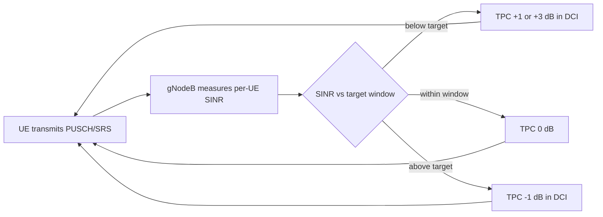

This section provides an overview of the Closed-Loop Power Control High-Band feature for NR high-band (FR2, mmWave) carriers operating as PCells or SCells in a carrier aggregation configuration.

## Overview and Open-Loop Baseline

Closed-Loop Power Control High-Band introduces network-controlled, closed-loop adjustment of UE uplink transmit power. Without this feature, high-band uplink power is governed purely by open-loop power control, where the UE estimates its pathloss from SSB or CSI-RS measurements and derives its PUSCH, PUCCH, and SRS transmit power from broadcast $P_0$ and $\alpha$ values as specified in TS 38.213.

While open-loop control is adequate when pathloss estimates are accurate, pathloss estimation on FR2 carriers is inherently noisy due to:
- Beamformed links changing gain abruptly when the UE or gNodeB switches beams.
- Blockage events causing step changes of 15–25 dB.
- UE power-class limitations interacting with beam-specific EIRP limits.

## Closed-Loop Operation

This feature closes the control loop through gNodeB feedback:
1. **Measurement:** The gNodeB continuously measures the received SINR and per-UE received power on PUSCH and SRS.
2. **Evaluation:** Measured values are compared against a configurable target.
3. **Adjustment:** The gNodeB issues Transmit Power Control (TPC) commands in DCI formats 0_1/0_2 using accumulated or absolute mode.

As a result, each UE converges on the minimum transmit power that satisfies the receive target.

## Benefits and Gains

- **Interference Reduction:** Reduces inter-cell and inter-beam interference.
- **Link Adaptation & Battery Life:** Improves uplink link adaptation accuracy and extends UE battery life.
- **Carrier Aggregation Stability:** In carrier aggregation deployments where UEs aggregate high-band SCells, it prevents uncontrolled uplink power on one carrier from raising the noise floor for co-scheduled UEs on adjacent beams.
- **Interference-over-Thermal (IoT):** Typical measured gains show a 1.5–3 dB reduction in average uplink IoT on loaded FR2 cells.
- **Cell-Edge Throughput:** Yields a 10–20% improvement in uplink cell-edge throughput, as cell-edge UEs no longer compete against over-powered cell-center UEs.

# Cross-References

- [Feature Operation](feature-operation.md)
- [Parameters](parameters.md)
