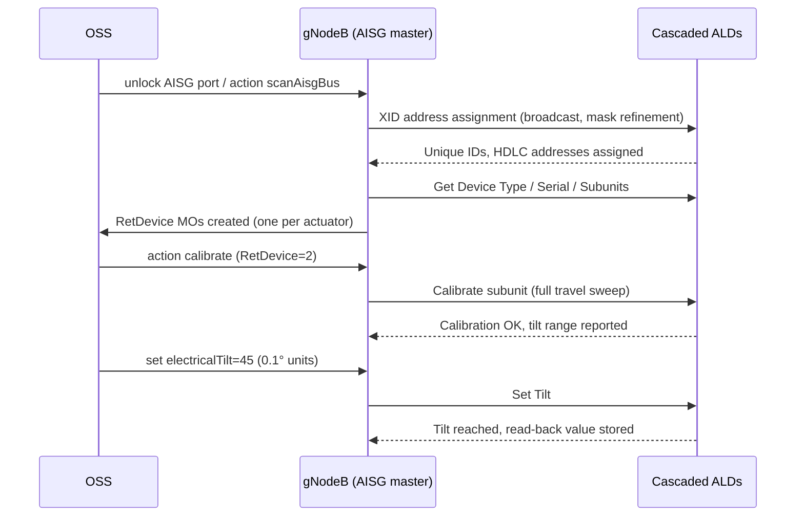

This section details the operational flow of the Cascaded RET Support feature in the gNodeB (AISG master), covering bus scanning, device discovery, subunit calibration, electrical tilt configuration, and ongoing device supervision.

## Discovery and Scanning Workflow

Operation begins with bus scanning when a RET-capable port is unlocked. The node executes the AISG device-scan state machine:

1. **Address Assignment:** Broadcasts an XID address-assignment frame and collects unique-ID responses from all unaddressed devices.
2. **Collision Resolution:** Resolves collisions using mask refinement and assigns each Antenna Line Device (ALD) a distinct HDLC address.
3. **Device Information Retrieval:** Reads the device type, vendor code, serial number, and number of subunits for each discovered device. Multi-RET actuators expose one subunit per drivable array.
4. **MO Instantiation:** Instantiates or matches a `RetDevice` Managed Object (MO) for each discovered actuator.

## Operation Sequence

## Calibration, Tilt Setting, and Supervision

- **Calibration:** Following discovery, each actuator must undergo a single calibration (a full-travel sweep allowing the actuator to learn its mechanical end stops) before any tilt commands are accepted.
- **Electrical Tilt Adjustment:** Tilt is configured in 0.1-degree units within the range reported by the device.
- **Continuous Supervision:** The node continuously supervises each device using a keep-alive poll. If a device stops responding, the node raises an ALD supervision alarm specifying the exact position of the fault within the cascade, accelerating fault localization on shared-antenna sites.

# Cross-References

- [Feature Overview](feature-overview.md)
