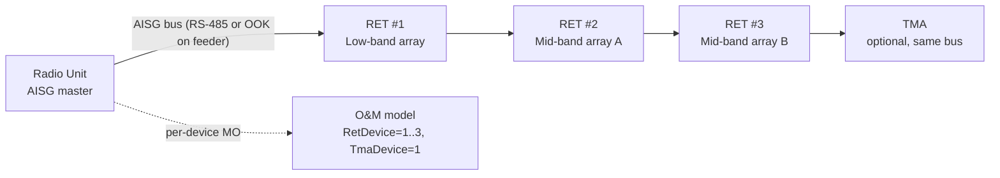

This section provides an overview of the Cascaded RET Support feature, which enables remote electrical tilt control for daisy-chained Antenna Line Devices (ALDs) on a single AISG bus.

## Overview

Cascaded RET Support extends the node's Remote Electrical Tilt (RET) control capability to antenna installations where multiple RET motor units are daisy-chained on a single AISG (Antenna Interface Standards Group) bus, rather than each RET unit having its own dedicated control port. This is the dominant physical topology on multi-band macro sites: a single antenna radome frequently houses two to six independently tiltable arrays (for example a low-band array plus two mid-band arrays), and site installers connect all of their RET actuators in a cascade on one AISG control cable to minimize feeder and connector count.

Without cascade support, the node can only address the first RET unit on the bus; the remaining actuators are invisible to O&M and can only be tilted by a technician with a portable controller at the site — defeating the purpose of remote electrical tilt. With this feature activated, the node performs AISG v2.0/v3.0 device scanning on each RET-capable port, discovers every ALD (Antenna Line Device) on the chain via its unique HDLC address assignment procedure, and creates one manageable `RetDevice` MO instance per discovered actuator. Each actuator can then be calibrated, tilted, and supervised individually from the OSS, exactly as if it were connected point-to-point.

## Transport Variants

The AISG bus is carried either on a dedicated multi-core control cable (RS-485 layer) or modulated onto the antenna feeder as an OOK (On-Off Keying) signal injected by a smart bias-tee in the radio unit. Both transport variants are supported, and mixed chains — where the first device is feeder-modem-connected and subsequent devices are daisy-chained on RS-485 — are handled transparently.

## Operational Value and Capacity

The practical value is operational: tilt optimization campaigns (manual or driven by SON/automated coverage optimization) can address every array on every site from the network management layer, with per-device calibration status, alarm supervision, and tilt read-back. A cascade of up to 12 ALDs per port is supported, with a total bus current budget enforced by the radio unit hardware.
