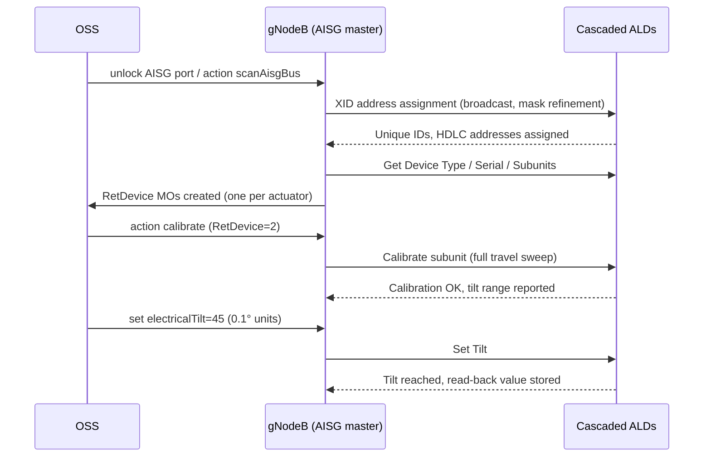

This section describes the operational workflow for Cascaded RET Support, including AISG bus scanning, Antenna Line Device (ALD) discovery, address assignment, subunit calibration, electrical tilt configuration, and continuous device supervision by the gNodeB.

## Bus Scanning and Device Discovery

Operation begins with bus scanning. When a RET-capable port is unlocked, the node runs the AISG device-scan state machine:

1. **Address Assignment**: The node broadcasts an XID address-assignment frame, collects unique-ID responses from all unaddressed devices, resolves collisions by mask refinement, and assigns each ALD a distinct HDLC address.
2. **Device Data Reading**: For each discovered device, the node reads the device type, vendor code, serial number, and number of subunits (multi-RET actuators expose one subunit per drivable array).
3. **MO Instantiation**: The node instantiates or matches a `RetDevice` Managed Object (MO).

## Operation Sequence

## Calibration, Tilt Control, and Supervision

* **Calibration**: After discovery, each actuator must be calibrated once via a full-travel sweep—allowing the actuator to learn its mechanical end stops—before tilt commands are accepted.
* **Electrical Tilt Setting**: Tilt is set in 0.1-degree units within the device-reported range.
* **Supervision and Alarms**: The node continuously supervises each device with a keep-alive poll. If a device stops responding, an ALD supervision alarm is raised identifying the exact position in the cascade, which materially shortens fault localization on shared-antenna sites.
