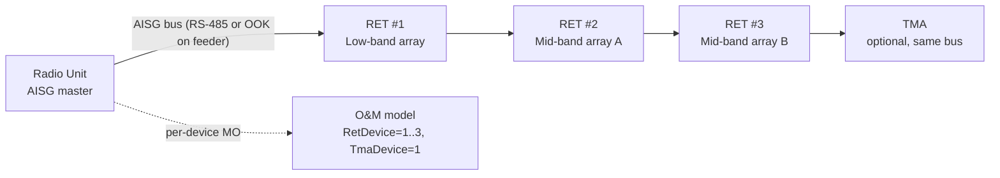

This section provides a high-level overview of the Cascaded RET Support feature within the Cascaded RET Support documentation. It details how the feature extends node remote electrical tilt control to daisy-chained Antenna Interface Standards Group (AISG) bus topologies on multi-band macro sites.

## Functional Description

Cascaded RET Support extends the node's Remote Electrical Tilt (RET) control capability to antenna installations where multiple RET motor units are daisy-chained on a single AISG bus, rather than each RET unit having its own dedicated control port. This is the dominant physical topology on multi-band macro sites, where a single antenna radome frequently houses two to six independently tiltable arrays (for example, a low-band array plus two mid-band arrays), and site installers connect all RET actuators in a cascade on one AISG control cable to minimize feeder and connector count.

Without cascade support, the node can only address the first RET unit on the bus; the remaining actuators are invisible to O&M and can only be tilted by a technician with a portable controller at the site.

With this feature activated, the node:
* Performs AISG v2.0/v3.0 device scanning on each RET-capable port.
* Discovers every Antenna Line Device (ALD) on the chain via its unique HDLC address assignment procedure.
* Creates one manageable `RetDevice` Managed Object (MO) instance per discovered actuator.

Each actuator can then be calibrated, tilted, and supervised individually from the OSS, exactly as if it were connected point-to-point.

## Transport Variants

The AISG bus is carried via either:
* **Dedicated multi-core control cable**: Using the RS-485 layer.
* **Modulated signal on antenna feeder**: Using an On-Off Keying (OOK) signal injected by a smart bias-tee in the radio unit.

Both transport variants are supported, and mixed chains—where the first device is feeder-modem-connected and subsequent devices are daisy-chained on RS-485—are handled transparently.

## Topology Diagram

## Operational Value and Limits

The practical value is operational: tilt optimization campaigns (manual or driven by SON/automated coverage optimization) can address every array on every site from the network management layer, providing per-device calibration status, alarm supervision, and tilt read-back.

* **Capacity Limit**: A cascade of up to 12 ALDs per port is supported.
* **Hardware Enforcement**: A total bus current budget is enforced by the radio unit hardware.

# Cross-References

* [Feature Operation](feature-operation.md)
* [Activation Procedure](activation-procedure.md)
